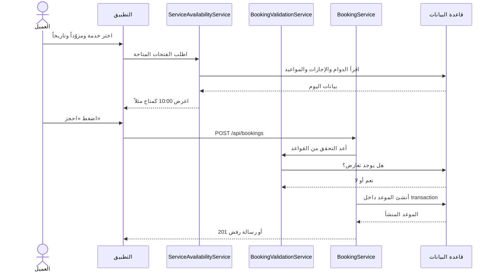
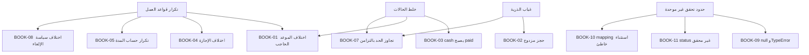

# تحليل تعليمي عميق لمشكلات التوفّر والحجز `BOOK-01` إلى `BOOK-11`

> **نوع الوثيقة:** تحليل وشرح وخطة إصلاح فقط  
> **لا تتضمن:** أي تعديل فعلي على كود التطبيق أو قاعدة البيانات أو الإعدادات  
> **تاريخ التحقق:** 2026-08-29  
> **نطاق التحقق:** الكود الحالي في المشروع + migrations + الاختبارات الحالية + لقطة قراءة فقط من قاعدة البيانات المحلية `BarberBooking`

---

## 1. لماذا هذه المشكلات مربكة؟

المشكلات الواردة في النص ليست 11 أخطاء منفصلة تماماً. معظمها ناتج عن أربعة جذور مشتركة:

1. **قاعدة العمل نفسها مكتوبة في أكثر من مكان.**
   مثال: تعريف «أي موعد يحجب وقت المزوّد؟» موجود بصيغ مختلفة في طبقة عرض التوفّر، وطبقة قبول الحجز، ولوحة الموظفين، وتحليل الفجوات.

2. **خلط حالات مستقلة ببعضها.**
   `created_status` يجيب عن سؤال «هل الحجز مؤكد ويحجز الوقت؟»، بينما `payment_status` يجيب عن سؤال «هل دخل المال فعلاً؟»، و`status` يجيب عن سؤال «ما الحالة التشغيلية للموعد؟». الكود الحالي يربط بعضها ببعض بطريقة غير صحيحة في بعض المسارات.

3. **التحقق يحدث قبل الكتابة من دون حماية من التزامن.**
   رؤية الفتحة فارغة لا تعني أن طلباً آخر لم يرها فارغة في اللحظة نفسها.

4. **حدود النظام ليست كلها متساوية في التحقق.**
   طلب الـ API يمر عبر `BookingCreateRequest`، لكن بعض المسارات الداخلية تستدعي `BookingService::createBooking()` مباشرة، لذلك لا يجوز اعتبار Form Request الحارس الوحيد.

الفكرة الأهم: الحجز ليس مجرد `INSERT`. الحجز محاولة لتغيير حالة مورد مشترك—وقت مزوّد خدمة—ويجب أن تبقى قواعد قراءة هذا المورد وكتابته متطابقة وذرّية.

---

## 2. النموذج الذهني الذي يجب فهمه أولاً

### 2.1 رحلة العميل الحالية باختصار



وجود تحققين ليس خطأ بحد ذاته؛ عرض التوفّر لقطة قد تصبح قديمة قبل الضغط. الخطأ هو أن التحققين يطبّقان **تعريفين مختلفين** للتعارض.

### 2.2 الحالات الثلاث ليست الشيء نفسه

| الحقل | السؤال الذي يجيب عنه | أمثلة |
|---|---|---|
| `created_status` | هل أصبح الحجز مؤكداً/فعّالاً ويحجب الوقت؟ | `0` غير مؤكد، `1` مؤكد |
| `status` | أين وصل الموعد تشغيلياً؟ | `PENDING`, `COMPLETED`, `USER_CANCELLED` |
| `payment_status` | أين وصلت حركة المال؟ | `PENDING`, `PAID_ONLINE`, `PAID_ONSTIE_CASH` |
| `payment_method` | كيف ينوي العميل أو الموظف الدفع؟ | `cash`, `online` |

مثال صحيح منطقياً لحجز نقدي قادم:

```text
created_status = 1                 ← الوقت محجوز
status         = PENDING           ← الخدمة لم تنتهِ بعد
payment_method = cash              ← النية: الدفع نقداً عند الحضور
payment_status = PENDING           ← لم يدخل المال بعد
```

أما الحالة الحالية في مسار API النقدي فهي تجعل `payment_status = PAID_ONSTIE_CASH` فور إنشاء الحجز، رغم أن العميل لم يصل بعد.

### 2.3 ما معنى تداخل فترتين زمنيتين؟

الفترة الجديدة `[newStart, newEnd)` تتداخل مع فترة موجودة `[oldStart, oldEnd)` عندما:

```text
oldStart < newEnd  AND  oldEnd > newStart
```

استخدام `<` و`>` مقصود، لأنه يسمح بموعدين متجاورين:

| الموعد الموجود | الموعد الجديد | النتيجة |
|---|---|---|
| 10:00–10:30 | 10:30–11:00 | لا يوجد تداخل |
| 10:00–10:30 | 10:15–10:45 | يوجد تداخل |
| 10:00–11:00 | 10:20–10:40 | يوجد تداخل كامل |
| 10:00–11:00 | 09:30–11:30 | يوجد تداخل كامل |

هذه المعادلة نفسها يجب أن تُستخدم في كل مكان يسأل: «هل المزوّد مشغول؟».

---

## 3. ملخص تنفيذي للمشكلات

| الرمز | المشكلة | التأكد من الكود الحالي | الخطر الأساسي |
|---|---|---:|---|
| `BOOK-01` | طبقة التوفّر وطبقة الحجز تختلفان في تعريف الموعد الحاجب | ✅ **مُصلَحة 2026-09-07** | فتحات مخفية بلا داعٍ أو فتحات تُعرض ثم تُرفض |
| `BOOK-02` | سباق `TOCTOU` يسمح بحجزين متداخلين | ✅ **مُصلَحة 2026-09-07** | حجز مزدوج عند الطلبات المتزامنة |
| `BOOK-03` | الحجز النقدي من العميل يُعلّم مدفوعاً فوراً | ✅ **مُصلَحة 2026-09-07** | إيرادات وتقارير وفواتير غير متسقة |
| `BOOK-04` | التحقق من الإجازات لا يدعم المدى و`NULL` مثل طبقة التوفّر | ✅ **مُصلَحة 2026-09-07** | حجز أثناء إجازة المزوّد |
| `BOOK-05` | `custom_duration` لا تُقرأ بسبب `return` مبكر | مؤكد | جداول غير واقعية وتأخير أو وقت ضائع |
| `BOOK-06` | فحص duplicate يفحص تقاطع الخدمات لا تطابقها | ✅ **مُصلَحة 2026-09-07** | **السماح بتعارض عميل** (لا رفض خاطئ) |
| `BOOK-07` | الحد اليومي يحسب `PENDING` فقط ومن دون حماية تزامن | مؤكد تقنياً، وتعريف الحد قرار عمل | تجاوز الحد أو عدّ غير مطابق للسياسة |
| `BOOK-08` | مسار إلغاء الحجز لا يفحص وقت البداية ولا مهلة الإلغاء | ✅ **مُصلَحة 2026-09-07** | سياستان متضاربتان + لا رقابة على الإلغاء المتكرر |
| `BOOK-09` | معرّف محذوف/قديم في مسار داخلي قد ينتج `TypeError` | ✅ **مُصلَحة 2026-09-07** | 500 مؤكَّد تجريبياً عند حذف أي خدمة |
| `BOOK-10` | `ModelNotFoundException` يتحول إلى 500 | مؤكد | عقد API خاطئ وتشويش المراقبة |
| `BOOK-11` | `status` غير محقق، و`status=0` لا يُطبّق أصلاً | مؤكد | 500 أو نتائج غير مفلترة بصمت |

---

# 4. `BOOK-01` — قاعدتان مختلفتان لما يحجب وقت المزوّد

> ## ✅ الحالة: مُصلَحة بتاريخ 2026-09-07
>
> **القرار التجاري المتخذ (يحسم القسم 4.6 أدناه):** لا يوجد دفع أونلاين ولن يوجد حالياً — كل الدفع نقدي في المحل. لذلك **لا يوجد حجز مؤقت أصلاً**، ولا حاجة لـ `reservation_expires_at`: كل حجز يُنشأ مؤكداً (`created_status = 1`) ويحجب وقته فوراً.
>
> **ما نُفِّذ فعلياً:**
> 1. `Appointment::scopeBlocksProviderTime()` + `Appointment::scopeOverlapping()` — تعريف واحد لسؤال «هل المزوّد مشغول؟».
> 2. `ServiceAvailabilityService::getProviderAppointments()` و`BookingValidationService::validateTimeSlotAvailability()` صارا يستدعيان الاثنين — انتهى بُعد `created_status` **وبُعد `COMPLETED`** معاً (`COMPLETED` صار يحجب في الطبقتين، لأن موعداً يُعلَّم مكتملاً باكراً ما زال يملك بقية نافذته).
> 3. `BookingService` صار `$isConfirmed = true` دائماً، و`payment_method` صار نيّة فقط.
> 4. migration `2026_09_07_100000` غيّرت الـ default إلى `1` ورفعت كل الصفوف الموجودة (كانت **كل** الصفوف `0`، فكانت التقارير واللوحة تعرض صفراً).
>
> **اختبارات تحرس هذا:** `Step4BookingCreationTest` (موعد `COMPLETED` يُخفى ويُرفض في الطبقتين، والملغى يُعرض ويُقبل في الطبقتين) و`Step3ProviderSlotsTest`.
>
> ما تبقى أدناه هو التحليل الأصلي، محفوظاً كسياق تاريخي.

## 4.1 ماذا يفعل الكود الحالي؟

طبقة التوفّر تقرأ مواعيد `PENDING` فقط، ولا تفحص `created_status`:

```php
Appointment::where('provider_id', $provider->id)
    ->whereDate('appointment_date', $date)
    ->whereIn('status', [AppointmentStatus::PENDING])
    ->select('start_time', 'end_time')
    ->get();
```

المصدر: `app/Services/ServiceAvailabilityService.php` → `getProviderAppointments()`

طبقة الحجز لا ترى إلا `created_status = 1`، لكنها تعتبر `PENDING` و`COMPLETED` حاجبين:

```php
Appointment::where('provider_id', $provider->id)
    ->whereDate('appointment_date', $date)
    ->where('created_status', 1)
    ->whereIn('status', [
        AppointmentStatus::PENDING->value,
        AppointmentStatus::COMPLETED->value,
    ])
    ->where('start_time', '<', $endTime)
    ->where('end_time', '>', $startTime)
    ->exists();
```

المصدر: `app/Services/BookingValidationService.php` → `validateTimeSlotAvailability()`

إذن لدينا اختلافان:

| البعد | طبقة التوفّر | طبقة الحجز |
|---|---|---|
| التأكيد | لا تفحص `created_status` | تشترط `created_status = 1` |
| الحالة | `PENDING` فقط | `PENDING + COMPLETED` |

## 4.2 العطل الأول: حجز غير مؤكد يخفي الفتحة

مثال:

1. العميل يبدأ دفعاً أونلاين لموعد 14:00.
2. `BookingService` ينشئ الموعد بقيمتي `created_status = 0` و`payment_status = PENDING`.
3. العميل يغلق صفحة الدفع.
4. طبقة التوفّر ترى الموعد لأنه `PENDING`، فتخفي 14:00.
5. طبقة الحجز لا تراه لأنه غير مؤكد؛ لذلك طلب مباشر للوقت نفسه يمكن أن يُقبل.

ما يراه المستخدم العادي: الفتحة لا تظهر أصلاً، مع أنه لا يوجد حجز مؤكد عليها.

تصحيح مهم لعبارة «إلى الأبد»: السجل المهجور قد يبقى في قاعدة البيانات بلا نهاية إذا لم توجد عملية تنظيف، لكنه يؤثر في **عرض فتحة ذلك التاريخ حتى تمر**؛ لا يحذف الساعة 14:00 من كل الأيام المستقبلية.

## 4.3 العطل الثاني: موعد `COMPLETED` قد يظهر متاحاً ثم يُرفض

طبقة العرض لا تعتبر `COMPLETED` حاجباً، بينما طبقة الحجز تعتبره حاجباً. السيناريو الأدق ليس موعداً قديماً الساعة 10:00، لأن منطق اليوم يتجاوز الأوقات الماضية. يظهر التعارض مثلاً عندما:

- يُعلّم الموظف موعداً مكتملاً قبل نهاية نافذته المجدولة؛ أو
- توجد بيانات غير متسقة تجعل موعداً مستقبلياً `COMPLETED`؛ أو
- يبقى جزء من النافذة المجدولة مستقبلياً بعد الإكمال المبكر.

عندها قد تعرض طبقة التوفّر فتحة تتقاطع معه، ثم ترفضها طبقة الحجز.

## 4.4 ماذا قالت قاعدة البيانات المحلية؟

لقطة القراءة بتاريخ 2026-08-29 أظهرت:

- 4 مواعيد بحالة `created_status=0 + status=PENDING + payment_status=PENDING`.
- 3 منها كانت ذات وقت مستقبلي لحظة الفحص.
- قاعدة البيانات الحالية لا تحتوي أي موعد `created_status=1` في اللقطة المقروءة.

هذا لا يثبت وحده أن كل السجلات الأربعة «مهجورة»، لكنه يثبت أن اختلاف القاعدتين ليس افتراضاً نظرياً: توجد بيانات تقع فعلياً في المنطقة التي تتعامل معها الطبقتان بشكل مختلف.

## 4.5 الجذر الحقيقي

هذا `Parity Bug`: سؤال عمل واحد له أكثر من إجابة برمجية. حتى لو عدّلنا الاستعلامين يدوياً اليوم، يمكن أن ينحرف أحدهما لاحقاً.

توجد صيغ أخرى قريبة في:

- `app/Services/DashboardService.php`
- `app/Services/GapAnalysisService.php`
- `app/Models/Appointment.php` → `scopePushable()`

ولا يعني ذلك أن كل هذه السياقات يجب أن تستخدم الحالات نفسها دائماً؛ بل يجب تسمية كل سياسة بوضوح، وعدم نسخ شروط مجهولة المعنى.

## 4.6 القرار التجاري المطلوب قبل الإصلاح

كيف يجب أن نتعامل مع دفع أونلاين جارٍ؟ يوجد خياران صحيحان، لكن المزج بينهما خطأ:

### الخيار A — لا يوجد حجز مؤقت

- `created_status=0` لا يحجب الوقت أبداً.
- لا يظهر في التوفّر ولا يمنع حجزاً آخر.
- قد يخسر العميل الفتحة أثناء وجوده في بوابة الدفع.
- أبسط تقنياً، لكنه تجربة دفع أضعف.

### الخيار B — حجز مؤقت منتهي الصلاحية، وهو الأنسب للدفع الأونلاين عادةً

- إنشاء `reservation_expires_at` أو كيان مستقل للحجز المؤقت.
- الحجز غير المؤكد يحجب الوقت فقط عندما `reservation_expires_at > now()`.
- نجاح الدفع يحوله إلى مؤكد.
- انتهاء المهلة يحرره آلياً.
- طبقة العرض وطبقة الكتابة تستخدمان الشرط نفسه.

مجرد إضافة job بعد 30 دقيقة مع إبقاء تعريف الطبقتين مختلفاً لا يكفي؛ يجب أن يكون **معنى الحجب نفسه موحداً**.

## 4.7 آلية الإصلاح المقترحة

1. تعريف سياسة واحدة مثل `scopeBlockingProviderTime()` أو `AppointmentBlockingPolicy`.
2. تعريف سياسة التداخل مرة واحدة.
3. استخدامهما في التوفّر والتحقق ولوحة الموظفين وتحليل الفجوات حيث ينطبق السؤال نفسه.
4. إضافة انتهاء صلاحية واضح للحجوزات الأونلاين غير المكتملة إن تم اختيار الحجز المؤقت.
5. مراجعة البيانات الحالية قبل تغيير الفلترة، لأن قلب الشرط قد يُظهر فتحات كانت مخفية أو يخفي فتحات كانت ظاهرة.

مثال توضيحي، وليس تعديلاً منفذاً:

```php
public function scopeBlockingProviderTime(Builder $query, Carbon $at): Builder
{
    return $query->where(function (Builder $query) use ($at) {
        $query->where('created_status', 1)
            ->orWhere(function (Builder $hold) use ($at) {
                $hold->where('created_status', 0)
                    ->where('reservation_expires_at', '>', $at);
            });
    })->whereIn('status', [
        AppointmentStatus::PENDING->value,
        AppointmentStatus::COMPLETED->value,
    ]);
}
```

إذا تقرر أن `COMPLETED` لا يجب أن يحجب وقتاً مستقبلياً، فيجب تغيير هذا القرار في **كل المستهلكين** وإضافة invariant يمنع أصلاً وجود موعد مستقبلي مكتمل بلا تفسير.

## 4.8 اختبارات القبول المطلوبة

- الحجز `PENDING + confirmed` لا يظهر متاحاً ويُرفض عند الكتابة.
- الحجز `PENDING + unconfirmed + hold غير منتهٍ` يعامل بالطريقة نفسها في الطبقتين.
- الحجز المؤقت المنتهي يظهر متاحاً وتقبله طبقة الحجز.
- الموعد الملغى لا يحجب الوقت.
- حالات `COMPLETED` تطابق القرار التجاري المختار.
- اختبار مصفوفة يثبت أن كل فتحة تعرضها availability تقبلها validation عند ثبات البيانات.
- الاختبار الحالي `accepts every slot the availability endpoint advertised` جيد كبداية، لكنه لا ينشئ حالات `unconfirmed` و`COMPLETED`، ولذلك لا يكتشف هذا الانحراف.

---

# 5. `BOOK-02` — الحجز المزدوج بسبب `TOCTOU`

> ## ✅ الحالة: مُصلَحة بتاريخ 2026-09-07
>
> ### القرارات المتخذة
>
> | السؤال | القرار |
> |---|---|
> | آلية القفل | قفل صف المزوّد في `users` (`SELECT … FOR UPDATE`) |
> | `StaffDashboard::updateAppointment()` | يفحص التعارض الآن، مع احترام صلاحية `force_booking` |
> | رد خسارة السباق | `409 Conflict` مع `error_type: slot_conflict` |
> | الحد اليومي للعميل | يُعاد عدّه داخل المعاملة تحت قفل صف العميل |
>
> ### ما نُفِّذ فعلياً
>
> **1. `BookingLockService` جديد** (`app/Services/BookingLockService.php`) —
> `lockUsers(array $userIds)` يأخذ أقفال صفوف على `users` **مرتّبة تصاعدياً بالـ id**.
> المزوّدون والعميل كلهم صفوف في نفس الجدول `users`، فالقفل الواحد المرتّب يغطي
> الاثنين ويجعل الترتيب موحّداً بين كل الطلبات → **لا deadlock ممكن**.
>
> **2. `BookingService::createBooking()` أُعيد ترتيبه** — كل ما يعتمد على حالة
> مشتركة انتقل **داخل** المعاملة:
>
> ```text
> خارج المعاملة:  validateBasicData()      ← شكل الطلب فقط، رفض رخيص وسريع
>                 sortServicesByStartTime()
> ─────────────── DB::transaction ───────────────
>                 lockUsers([providers…, customer])   ← القفل أولاً
>                 validateDailyBookingLimit()         ← يُعاد تحت القفل
>                 validateAndPrepareServices()        ← فحص التعارض تحت القفل
>                 calculateTotals()
>                 Appointment::create() + services + draft invoice
> ─────────────── COMMIT ───────────────
> ```
>
> **3. `assertNoConflictingAppointment()`** — استُخرج فحص التعارض من
> `validateTimeSlotAvailability()` إلى دالة عامة واحدة في `BookingValidationService`،
> لأن له أكثر من مستدعٍ الآن. يقبل `$ignoreAppointmentId` حتى لا يتعارض الموعد مع نفسه
> عند نقله.
>
> **4. `SlotUnavailableException`** (`app/Exceptions/`) — يرث
> `InvalidArgumentException` فما كسر ولا `catch` موجود، لكنه يسمح لـ
> `BookingController` بإرجاع `409` بدل `422`.
>
> **5. مسار «إضافة خدمة»** (`addServiceToBooking`) — تحليل الفجوة يبقى خارج
> المعاملة (لأن `PushRequiredException` بوابة تأكيد للمستخدم)، لكن داخل المعاملة صار
> يأخذ القفل ثم **يعيد التأكد** أن النافذة التي اختارها التحليل ما زالت فارغة.
>
> **6. `StaffDashboard::updateAppointment()`** — كان يكتب `start_time`/`end_time`
> **بلا أي فحص تعارض ولا معاملة**. صار داخل معاملة + قفل + فحص تعارض يستثني الموعد
> نفسه. حاملو `force_booking` يتجاوزونه كما في إنشاء الحجز.
>
> **7. فهرس مركّب** `appointments_conflict_lookup_idx` على
> `(provider_id, appointment_date, created_status, status)` — migration
> `2026_09_07_120000`. قبله كان فحص التعارض يمسح كل مواعيد المزوّد بكل التواريخ.
>
> ### كيف يعمل النظام بعد الإصلاح
>
> ```text
> الطلب A                                  الطلب B
> ──────────────────────────────────────────────────────────────
> BEGIN
> FOR UPDATE على صف المزوّد 7  ✔ حصل عليه
>                                          BEGIN
>                                          FOR UPDATE على صف المزوّد 7
>                                          ⏳ ينتظر… (محجوب)
> فحص التعارض → فاضي ✓
> INSERT الموعد
> COMMIT  → يحرّر القفل
>                                          ▶ يستيقظ ويكمل
>                                          فحص التعارض → مشغول ✗
>                                          ROLLBACK
>                                          → 409 slot_conflict
> ```
>
> الطلب الخاسر **لا يكتب شيئاً إطلاقاً** — لا موعد، ولا `appointment_services`،
> ولا فاتورة مسودة — لأن الفحص صار داخل المعاملة نفسها.
>
> ### العقد الذي يجب احترامه من الآن فصاعداً
>
> **القفل لا ينفع إلا إذا التزم به الجميع.** أي كود جديد يكتب
> `provider_id`/`appointment_date`/`start_time`/`end_time` على موعد **يجب**:
>
> 1. أن يكون داخل `DB::transaction()`.
> 2. أن يستدعي `BookingLockService::lockUsers()` أول شي.
> 3. أن يعيد فحص التعارض بـ `assertNoConflictingAppointment()` بعد القفل.
>
> الفحص خارج المعاملة يبقى مسموحاً **كرفض سريع فقط**، لا كضمان.
>
> ### حدود الإصلاح (بصراحة)
>
> - الضمان **تطبيقي وليس على مستوى قاعدة البيانات**. مسار كتابة جديد ينسى القفل
>   يستطيع أن يخترق الحماية. الضمان المستقل يحتاج `slot ledger` بقيد فريد
>   (القسم 5.5 أدناه) — قرار مؤجَّل.
> - الاختبارات لا تشغّل طلبين متوازيين فعلياً (الـ suite يعمل على SQLite بمعاملة
>   واحدة)، بل تثبّت **البنية** التي يقوم عليها الضمان: أن القفل يُؤخذ، وأنه يُؤخذ
>   و`transactionLevel() > 0`، وأن الفشل لا يترك أي صف. `SQLite` يُسقط
>   `FOR UPDATE` بصمت، لذلك لا يجوز اختبار وجود القفل بمطابقة نص الـ SQL.
>
> ### الاختبارات الحارسة (`Step4BookingCreationTest`)
>
> - `locks the provider and the customer rows inside the booking transaction`
> - `rolls the whole booking back when the slot is taken`
> - `locks the provider row before moving an appointment onto the calendar`
> - `refuses a slot already taken` → تتحقق من `409` و`error_type: slot_conflict`
>
> ما تبقى أدناه هو التحليل الأصلي، محفوظاً كسياق تاريخي.

## 5.1 ما معنى `TOCTOU`؟

`Time Of Check To Time Of Use` تعني أن النظام يتحقق في لحظة، ثم يستخدم نتيجة التحقق في لحظة لاحقة، وبين اللحظتين يمكن أن تتغير الحقيقة.

الكود الحالي يفعل الآتي:

```text
validateBasicData()
validateDailyBookingLimit()
validateAndPrepareServices()  ← هنا فحص التعارض
calculateTotals()
DB::transaction(...)          ← المعاملة تبدأ لاحقاً
```

المصدر: `app/Services/BookingService.php` → `createBooking()`

## 5.2 سيناريو طلبين متزامنين

| الزمن | الطلب A | الطلب B |
|---|---|---|
| t0 | يفحص 10:00، لا يجد موعداً | — |
| t1 | — | يفحص 10:00، لا يجد موعداً |
| t2 | يبدأ transaction وينشئ الموعد | — |
| t3 | — | يبدأ transaction وينشئ الموعد |
| النتيجة | موعد 10:00 موجود | موعد ثانٍ متداخل موجود |

السبب أن نجاح `SELECT` لا يحجز شيئاً.

## 5.3 لماذا `lockForUpdate()` على استعلام المواعيد ليس ضماناً كافياً وحده؟

النص المرفق اقترح وضع `lockForUpdate()` على استعلام التعارض. هذا مفيد عندما توجد صفوف يمكن قفلها، لكنه ليس ضماناً مستقلاً للحالة الأهم: **لا يوجد صف بعد**.

في القاعدة الحالية:

- المحرك `MariaDB 10.4.32`.
- الجدول `InnoDB`.
- العزل `REPEATABLE-READ`.
- لا يوجد فهرس مركّب مناسب لاستعلام التعارض.

قد تستخدم InnoDB أقفال نطاق في بعض الخطط والفهارس، لكن بناء سلامة العمل على تفاصيل خطة استعلام قابلة للتغير مخاطرة. كما أن `exists()` مع قفل لا يجعل «الفراغ» مورداً واضحاً تتفق كل المسارات على قفله.

## 5.4 وضع الفهارس الحالي

الفهارس الفعلية في `appointments` لحظة الفحص:

```text
PRIMARY(id)
appointments_customer_id_foreign(customer_id)
appointments_parent_id_idx(parent_appointment_id)
appointments_provider_id_foreign(provider_id)
```

لا يوجد قيد فريد للفتحة، ولا فهرس مركّب على حقول كشف التعارض.

ولم تظهر في لقطة البيانات الحالية أزواج متداخلة مؤكدة، وهذا يعني «لم نجد حادثاً في اللقطة»، لا «لا توجد ثغرة سباق».

## 5.5 الإصلاح الآمن على ثلاث طبقات

### الطبقة الأولى — transaction تشمل التحقق والإنشاء

يجب أن تدخل التحققات الحساسة للتزامن داخل المعاملة:

- حد العميل اليومي.
- قفل المزوّد/المزوّدين.
- إعادة فحص التعارض.
- إنشاء الموعد وخدماته.

يمكن إبقاء التحقق الشكلي الرخيص خارجها، ثم إعادة ما يلزم داخلها.

### الطبقة الثانية — قفل مورد موجود دائماً

الحل العملي في البنية الحالية هو قفل صف المزوّد في `users` قبل إعادة فحص التداخل:

```php
DB::transaction(function () use ($providerIds) {
    User::query()
        ->whereIn('id', collect($providerIds)->sort()->values())
        ->orderBy('id')
        ->lockForUpdate()
        ->get();

    // بعد امتلاك أقفال كل المزوّدين:
    // 1) أعد فحص التعارض
    // 2) أنشئ الموعد
});
```

لماذا هذا أقوى؟ لأن صف المزوّد موجود حتى عندما لا توجد مواعيد. كل طلب يحجز مع المزوّد نفسه ينتظر القفل نفسه، ثم يعيد الفحص بعد انتهاء الطلب السابق.

شرط نجاحه: **كل مسارات إنشاء/نقل/تمديد الموعد يجب أن تلتزم بالقفل نفسه**. وإذا كان الحجز يضم عدة مزوّدين، يجب قفلهم بترتيب ثابت لتقليل deadlocks.

### الطبقة الثالثة — ضمان قاعدة بيانات مناسب للنموذج

قيد `UNIQUE(provider_id, start_time)` وحده ليس حلاً كاملاً، وله مشكلتان:

1. يمنع البدايات المتطابقة فقط، ولا يمنع 10:00–10:30 مع 10:15–10:45.
2. إذا بقي الموعد الملغى في الجدول، يمنع إعادة استخدام وقت بدايته، لأن MariaDB لا يملك partial unique index بسيطاً على «الحجوزات الفعالة فقط».

الخيارات الأقوى:

- **Slot ledger:** جدول حجوزات دقائق/فتحات بصف فريد لكل `provider_id + slot_start`، وتُحجز كل الوحدات التي تغطي مدة الموعد ذرّياً.
- **Generated active key:** ممكن لبعض حالات البداية المتطابقة، لكنه ما زال لا يغطي التداخل الجزئي بلا تصميم للفتحات.
- **PostgreSQL exclusion constraint:** إذا تغير المحرك مستقبلاً يمكن استخدام range exclusion لمنع أي تداخل على مستوى القاعدة.

التوصية المرحلية في MariaDB الحالية: transaction + قفل صفوف المزوّدين + إعادة تحقق + فهرس أداء مناسب، ثم Slot ledger إذا كان مطلوباً ضمان قاعدة بيانات مستقل حتى أمام مسار كود لا يلتزم بالقفل.

## 5.6 ماذا يجب أن يرى العميل عند خسارة السباق؟

حتى مع الحل الصحيح، طلب واحد سيفوز والآخر سيخسر. هذا طبيعي. المطلوب أن يخسر بلطف:

```http
HTTP/1.1 409 Conflict
Content-Type: application/json

{
  "success": false,
  "error_type": "slot_conflict",
  "message": "حُجز هذا الوقت قبل لحظات. اختر وقتاً آخر."
}
```

## 5.7 اختبارات القبول

- إطلاق طلبين متوازيين فعلياً لنفس المزوّد والنافذة؛ يجب أن ينجح واحد فقط.
- تكرار الاختبار عشرات المرات، لأن اختباراً متسلسلاً لا يكشف السباق.
- اختبار تداخل جزئي، لا البداية المتطابقة فقط.
- اختبار حجز متعدد المزوّدين بترتيب طلبات معاكس للتأكد من عدم حدوث deadlock دائم.
- اختبار نقل موعد وتمديد مدته، فهذه عمليات كتابة على المورد نفسه.

---

# 6. `BOOK-03` — `cash` تعني «سأدفع» لا «دفعت»

> ## ✅ الحالة: مُصلَحة بتاريخ 2026-09-07
>
> `BookingService::createBooking()` صار `$markAsPaid = $bookingData['mark_as_paid'] ?? false;` بدل `?? ($paymentMethod == 'cash')`. أي حجز — من الـ API أو من لوحة الموظفين — يُنشأ الآن بـ `payment_status = PENDING`، والمال يُسجَّل فقط عند إنهاء الفاتورة على الكاشير.
>
> `Step4BookingCreationTest` كان يثبّت السلوك القديم الخاطئ؛ صار يؤكد `PENDING`.
>
> ما تبقى أدناه هو التحليل الأصلي، محفوظاً كسياق تاريخي.

## 6.1 السلوك الحالي

العميل مسموح له باختيار:

```php
'payment_method' => 'required|string|in:cash,online'
```

ثم يشتق `BookingService` حالتين من هذه القيمة:

```php
$isConfirmed = $bookingData['is_confirmed'] ?? ($paymentMethod == 'cash');
$markAsPaid  = $bookingData['mark_as_paid'] ?? ($paymentMethod == 'cash');
```

ثم يجعل الموعد النقدي:

```text
created_status = 1
payment_status = PAID_ONSTIE_CASH
```

المصدر: `app/Http/Requests/Api/BookingCreateRequest.php` → `rules()`  
المصدر: `app/Services/BookingService.php` → `createBooking()`

## 6.2 لماذا التأكيد صحيح والدفع خطأ؟

- التأكيد يعني أن الصالون سيحتفظ بالوقت للعميل الذي سيدفع عند الحضور.
- الدفع يعني أن حدثاً مالياً حصل فعلياً ويمكن إثباته بسجل دفع أو إغلاق فاتورة.

اختيار وسيلة الدفع لا يثبت وقوع الدفع.

## 6.3 التناقض داخل البيانات

في المعاملة نفسها ينشئ النظام فاتورة `DRAFT` بلا رقم فاتورة، ويمرر مبلغاً مدفوعاً `0`:

```php
$InvoiceService->createDtaftInvoiceFromAppointment(
    $appointment,
    'cash',
    0
);
```

المصدر: `app/Services/BookingService.php` → `createBooking()`  
المصدر: `app/Services/InvoiceService.php` → `createDtaftInvoiceFromAppointment()`

فتصبح الروايات الثلاث:

| المصدر | ماذا يقول؟ |
|---|---|
| `appointment.payment_status` | مدفوع نقداً |
| `invoice.status` | مسودة تنتظر الدفع |
| مبلغ الدفع عند إنشاء المسودة | صفر |

هذا تناقض محاسبي وتشغيلي، وليس مجرد تسمية.

## 6.4 الأثر

- `ProviderReportService` و`ReportsService` يجمعان الإيرادات حسب حالات الدفع الناجحة، فيمكن أن يحسبا مبالغ لم تُحصّل.
- موعد `NO_SHOW` نقدي قد يبقى ظاهراً كإيراد مدفوع إن لم يصحح لاحقاً.
- التسوية بين appointment وinvoice وpayment تصبح غير موثوقة.
- الاختبار الحالي `creates a cash booking and confirms it immediately` يتوقع صراحة `PAID_ONSTIE_CASH`، أي أنه يثبت السلوك الخاطئ بدلاً من كشفه.

## 6.5 نقطة إيجابية وحدّ الخطر الحقيقي

طلب API لا يستطيع حالياً حقن `mark_as_paid` أو `is_confirmed` مباشرة، لأن `BookingController` يستخدم `$request->validated()`، والقواعد لا تسمح بهذين الحقلين. الخلل ليس mass assignment من العميل؛ الخلل هو **الاشتقاق الداخلي الخاطئ من `payment_method=cash`**.

المسار الداخلي للموظفين يمرر أصلاً:

```php
'is_confirmed' => true,
'mark_as_paid' => false,
```

وهذا يبيّن أن الفصل بين البعدين موجود جزئياً في التصميم لكنه غير مطبق كافتراض آمن داخل الخدمة.

## 6.6 آلية الإصلاح

1. الحجز النقدي من API: `created_status=1`, `payment_status=PENDING`.
2. لا يتحول إلى `PAID_ONSTIE_CASH` إلا في مسار موظف موثوق بعد تحصيل فعلي.
3. التحول إلى مدفوع يجب أن يحدث مع إنشاء Payment/finalization داخل transaction واحدة.
4. يفضّل استبدال flags العامة في array بأوامر واضحة مثل:
   - `CreateCustomerBooking`
   - `CreateStaffBooking`
   - `RecordOnsitePayment`
5. لا تجعل `mark_as_paid` خياراً صامتاً ذا default مبني على وسيلة الدفع.

## 6.7 معالجة البيانات القديمة

قبل تعديل الكود يجب إعداد استعلام تدقيق لا تعديل تلقائي أعمى:

- مواعيد `PAID_ONSTIE_CASH`.
- الفاتورة ما زالت `DRAFT`.
- لا يوجد Payment ناجح مرتبط.
- الموعد قادم أو `NO_SHOW`.

هذه الصفوف مرشحة للتصحيح، لكنها تحتاج مراجعة لأن بعض الدفعات قد تكون حقيقية وسجلها ناقصاً.

## 6.8 اختبارات القبول

- cash عبر API: confirmed + payment pending.
- online قبل callback: غير مؤكد/hold حسب القرار + payment pending.
- callback ناجح: payment record + حالة مدفوعة + تأكيد ضمن transaction.
- تحصيل موظف نقداً: لا تصبح الحالة مدفوعة إلا بعد نجاح finalization.
- تقارير الإيراد لا تحسب حجز cash قادماً غير محصل.

---

# 7. `BOOK-04` — الإجازة الممتدة و`NULL end_date`

> ## ✅ الحالة: مُصلَحة بتاريخ 2026-09-07
>
> ### القرارات المتخذة
>
> | السؤال | القرار |
> |---|---|
> | معنى إجازة ساعية ممتدة | **فترة متصلة واحدة** — لا نافذة تتكرر كل يوم |
> | `end_date = NULL` | `COALESCE` في الطبقتين → تعني يوم البداية فقط |
> | إجازة تعبر منتصف الليل | تُرفض عند الإدخال (`end_time > start_time`) |
> | تحقق فورم الداشبورد | تحقق سيرفر كامل على الطرفين |
>
> ### دلالة «الفترة المتصلة» بالتفصيل
>
> إجازة ساعية: `10/9 12:00 → 15/9 13:00` تعني أن المزوّد **غائب باستمرار** من ظهر
> العاشر حتى الواحدة من الخامس عشر:
>
> | اليوم | المحجوب |
> |---|---|
> | يوم البداية (10/9) | من `start_time` حتى نهاية اليوم |
> | الأيام الوسطى (11–14/9) | **اليوم بأكمله** |
> | يوم النهاية (15/9) | من بداية اليوم حتى `end_time` |
> | يوم واحد (`start_date = end_date`) | من `start_time` حتى `end_time` |
>
> ### ما نُفِّذ فعلياً
>
> **1. `ProviderTimeOff::scopeCoveringDate($date)`** — تعريف واحد لنطاق التواريخ:
> `start_date <= d AND COALESCE(end_date, start_date) >= d`. تستعمله الطبقتان.
>
> **2. `ProviderTimeOff::blockedWindowOn(Carbon $date)`** — يُرجع الشريحة التي
> تشغلها الإجازة من ذلك اليوم، أو `null`. هنا تعيش دلالة «الفترة المتصلة».
> و`blocksWindow($start, $end)` تضيف فحص التداخل نصف المفتوح.
>
> **3. طبقة الحجز** (`validateProviderScheduleWindow`):
> - اليوم الكامل: `end_date >= $date` ← **يسقط الصفوف ذات `NULL`** (لأن
>   `NULL >= '…'` تساوي `UNKNOWN` لا `FALSE`) → صار `coveringDate()`.
> - الساعية: `whereDate('start_date', $date)` ← **يوم البداية فقط** → صار
>   `coveringDate()` ثم `blocksWindow()`.
> - حُذف `TIME(CONCAT(?, ' ', start_time))`: الـ `CONCAT` كان بلا فائدة (يركّب
>   التاريخ ثم `TIME()` تستخرج الوقت مرة أخرى) وكان `MySQL-ism` بينما الاختبارات
>   تعمل على SQLite.
>
> **4. طبقة التوفّر** — انتقلت من «نافذة تتكرر كل يوم» إلى `blocksWindow()`، وهذا
> **تغيير سلوك مقصود** أملاه القرار أعلاه.
>
> **5. تحقق إدخال الإجازة** (`StaffDashboard::timeOffValidationError()`) — يُطبَّق
> على مساري الحفظ: `end_date >= start_date`، وللساعية `start_time`/`end_time`
> مطلوبان و`end_time > start_time`. المفاتيح مترجمة en/ar/de.
>
> ### لماذا كانت المشكلة قابلة للوصول فعلاً
>
> في `staff-dashboard.blade.php` حقلا `startDate`/`endDate` **ظاهران دائماً** —
> خارج `x-show="timeOff.type === '0'"` الذي يخفي حقول الوقت فقط — و
> `StaffDashboard` يحفظ `end_date` للنوعين. فالموظف يستطيع إنشاء **إجازة ساعية
> ممتدة** من الواجهة. أما `end_date = NULL` فكانت كامنة (لا واجهة تنتجها) لكن
> الاختبار `giveFullDayLeave(..., null)` كان يثبتها على مستوى الكود.
>
> ### الاختبارات الحارسة
>
> - `Feature/Booking/ProviderTimeOffRangeTest.php` — 9 اختبارات وحدة لدلالة النافذة
>   (يوم بداية / وسط / نهاية / يوم واحد / `NULL` / يوم كامل / بيانات ناقصة / خارج
>   النطاق / الحد نصف المفتوح).
> - `Feature/Booking/Step4BookingCreationTest.php` — 4 اختبارات تكافؤ بين الطبقتين
>   للإجازة الساعية الممتدة، بالإضافة إلى قلب الاختبار
>   `blocks a booking during an open-ended full-day leave` (كان يوثّق البَغ).
> - `Feature/ProviderTimeOffValidationTest.php` — 5 اختبارات لتحقق الإدخال.
>
> ### ملاحظة لم تُعالَج
>
> فورم Filament (`TimeOffsRelationManager`) ينشئ الإجازة **الساعية بدون حقل
> `end_date` إطلاقاً** → تُحفظ `NULL`. هذا صحيح الآن بفضل `COALESCE`، لكن فلاتر
> «الإجازات المنتهية» في `ManageProviderLeaves` تستعمل `end_date < now()` فلا تظهر
> هذه الصفوف فيها أبداً. مشكلة عرض فقط، ولم تُلمس.
>
> ما تبقى أدناه هو التحليل الأصلي، محفوظاً كسياق تاريخي.

## 7.1 الفرق الحالي

طبقة التوفّر تتعامل مع الإجازة كمدى وتعتبر `end_date=NULL` إجازة ليوم البدء:

```sql
start_date <= :date
AND COALESCE(end_date, start_date) >= :date
```

المصدر: `app/Services/ServiceAvailabilityService.php` → `getFullDayTimeOff()` و`getProviderHourlyTimeOffs()`

طبقة الحجز:

- full day تستخدم `end_date >= :date`، فتفشل أمام `NULL`.
- hourly تستخدم `whereDate('start_date', $date)`، فلا ترى الأيام الواقعة بين البداية والنهاية.

المصدر: `app/Services/BookingValidationService.php` → `validateProviderScheduleWindow()`

## 7.2 لماذا `NULL` لا يساوي تاريخ البداية؟

في SQL:

```sql
NULL >= '2026-09-10'
```

لا تنتج `TRUE` أو `FALSE` بل `UNKNOWN`، وشرط `WHERE` لا يعيد الصف. لذلك إجازة يوم واحد ذات `end_date=NULL` تختفي من تحقق الحجز.

## 7.3 مثال الإجازة الممتدة

```text
start_date = 2026-09-10
end_date   = 2026-09-15
start_time = 12:00
end_time   = 13:00
type       = HOURLY
```

في 12 سبتمبر:

- availability ترى أن 12 سبتمبر داخل المدى وتخفي 12:00–13:00.
- booking validation تبحث عن `start_date = 2026-09-12`، فلا تجد الصف الذي بدأ في 10 سبتمبر.
- طلب مباشر أو slot قديم يمكن أن يمر.

## 7.4 حالة البيانات المحلية

لحظة الفحص:

| النوع | العدد | `end_date=NULL` | متعدد الأيام |
|---|---:|---:|---:|
| HOURLY | 4 | 0 | 0 |
| FULL_DAY | 7 | 0 | 7 |

إذن عطل hourly متعدد الأيام و`NULL` كامن في البيانات الحالية، لكن الاختبارات تحتوي حالة full-day مفتوحة تثبت الانحراف، وتحتوي availability على اختبار hourly متعدد الأيام من جهة العرض فقط.

## 7.5 الإصلاح

استخراج scope واحد على `ProviderTimeOff`:

```php
public function scopeCoveringDate(Builder $query, string $date): Builder
{
    return $query
        ->where('start_date', '<=', $date)
        ->whereRaw('COALESCE(end_date, start_date) >= ?', [$date]);
}
```

وللتداخل الزمني، لأن العمودين `TIME` فعلياً:

```php
public function scopeOverlappingTime(
    Builder $query,
    string $start,
    string $end,
): Builder {
    return $query
        ->where('start_time', '<', $end)
        ->where('end_time', '>', $start);
}
```

لا حاجة إلى `TIME(CONCAT(date, ' ', start_time))` للمقارنة اليومية الحالية؛ اللف حول العمود يعقّد الاستعلام وقد يضعف الاستفادة من الفهرس.

## 7.6 قرار دلالي مهم

إجازة hourly تمتد خمسة أيام يمكن أن تعني أحد شيئين:

- 12:00–13:00 في **كل يوم** من المدى.
- فترة مستمرة من 10 سبتمبر 12:00 إلى 15 سبتمبر 13:00.

الكود الحالي في availability يفسرها كنافذة يومية متكررة. يجب تثبيت هذا المعنى في التوثيق والواجهة والاختبارات. كما يجب اتخاذ قرار مستقل للإجازة العابرة لمنتصف الليل مثل 22:00–02:00، لأن معادلة الوقت اليومية البسيطة لا تغطيها.

## 7.7 اختبارات القبول

- full-day بتاريخ نهاية محدد.
- full-day ذات `end_date=NULL` تحجب يوم البداية فقط.
- hourly يوم واحد.
- hourly متعدد الأيام: يوم البداية، يوم وسط، يوم النهاية، ويوم خارج المدى.
- حدود متجاورة: إجازة تنتهي 12:00 وخدمة تبدأ 12:00 لا تتداخل.
- نفس المصفوفة تمر عبر availability وbooking validation.

---

# 8. `BOOK-05` — `custom_duration` ميزة موجودة شكلاً ومعطلة فعلياً

## 8.1 الكود الميت

في خدمتين توجد الدالة نفسها تقريباً:

```php
private function getEffectiveDuration(User $provider, Service $service): int
{
    return $service->duration_minutes;

    // لا يصل التنفيذ إلى هنا أبداً
    $pivot = DB::table('provider_service')->...->first();

    return $pivot->custom_duration ?? $service->duration_minutes;
}
```

المصدر: `app/Services/BookingService.php` → `getEffectiveDuration()`  
المصدر: `app/Services/ServiceAvailabilityService.php` → `getEffectiveDuration()`

أي سطر بعد أول `return` unreachable.

## 8.2 مثال تجاري

مدة الخدمة الافتراضية 30 دقيقة:

| المزوّد | `custom_duration` | المدة التي يقصدها المدير | المدة التي يستخدمها النظام الآن |
|---|---:|---:|---:|
| خبير | 20 | 20 | 30 |
| متدرّب | 45 | 45 | 30 |

- الخبير يخسر سعة كان يمكن بيعها.
- المتدرّب يتراكم عليه التأخير.
- availability وbooking يتفقان حالياً على القيمة الخطأ، لذلك قد لا يظهر رفض تقني؛ يظهر خلل تشغيلي في الواقع.

## 8.3 دليل البيانات المحلية

يوجد 7 صفوف في `provider_service` تحمل `custom_duration` غير null ومختلفة عن `services.duration_minutes`. تفعيل الميزة سيغيّر السلوك الفعلي لهذه الروابط فوراً، ولذلك لا ينبغي حذف `return` والنشر بلا مراجعة البيانات.

## 8.4 الإصلاح الصحيح بنيوياً

لا تكرر دالة effective duration في خدمتين. الأفضل جعل العلاقة/سياسة التسعير والمدة مصدراً واحداً، مثلاً:

```php
$duration = $providerService->custom_duration
    ?? $service->duration_minutes;
```

مع الشروط التالية:

- رابط `provider_service` فعّال.
- القيمة integer موجبة.
- حد أدنى وأقصى منطقيان.
- availability والحجز والفاتورة وتعديل الموعد تستخدم القيمة نفسها.
- تخزين المدة الفعلية snapshot على `appointment_services.duration_minutes` يبقى مهماً حتى لا تغيّر مدة خدمة قديمة تاريخ الموعد.

## 8.5 خطة نشر آمنة

1. تقرير بالقيم السبع الحالية وأصحابها للمراجعة الإدارية.
2. تصحيح القيم غير المقصودة قبل تفعيل القراءة.
3. اختبارات characterization للسلوك الافتراضي والمخصص.
4. تفعيل المصدر الموحد.
5. مقارنة عدد الفتحات وأوقات النهاية قبل/بعد على عينة من الأيام.

## 8.6 اختبارات القبول

- null يعود للمدة الافتراضية.
- 20 دقيقة تنتج end time صحيحاً في availability والحجز.
- رابط inactive لا يفعّل custom duration.
- صفر/قيمة سالبة تُرفض عند الإدخال، لا تتحول بصمت إلى دقيقة واحدة فقط.
- الموعد القديم يحتفظ بمدة snapshot بعد تغيير إعداد الخدمة.

---

# 9. `BOOK-06` — تقاطع خدمات ليس «نفس الخدمات»

> ## ✅ الحالة: مُصلَحة بتاريخ 2026-09-07
>
> ### ⚠️ تصحيح جوهري لعنوان المشكلة
>
> الوثيقة وصفت `BOOK-06` بأنه **«رفض حجوزات مشروعة»**. القرار التجاري المتخذ يقلب
> التوصيف: **العميل لا يستطيع التواجد في مكانين في الوقت نفسه**، فالحجز المتزامن
> ليس مشروعاً أصلاً. المشكلة الحقيقية كانت أن الفحص **متساهل**، لا متشدد.
>
> ### القرارات المتخذة
>
> | السؤال | القرار |
> |---|---|
> | القاعدة | **تداخل وقت العميل** — بصرف النظر عن المزوّد والخدمة |
> | نطاق المنع | صارم للعملاء؛ الموظف يتجاوزه بصلاحية `force_booking` |
> | الحالات المانعة | `PENDING + COMPLETED` (نفس قاعدة المزوّد) |
> | هوية العميل | تطبيع الهاتف + مطابقة `customer_id` **أو** الهاتف |
> | الفحص القديم | يُستبدل بالكامل |
>
> ### ما كان يحدث فعلياً (تحقّق تجريبي، لا استنتاج)
>
> شُغِّل اختبار probe فعلي على كل حالة:
>
> | # | السيناريو | النتيجة قبل | بعد |
> |---|---|---|---|
> | A | 10:00 [قص] موجود، حجز 10:00 مزوّد آخر [قص+ذقن] | يُرفض (لسبب خاطئ) | يُرفض |
> | B | 10:00 [قص] موجود، حجز 10:00 مزوّد آخر [**ماسك**] | **`201` مقبول** 🔴 | `422` |
> | C | 10:00–11:00 موجود، حجز **10:30** مزوّد آخر | **`201` مقبول** 🔴 | `422` |
> | D | 10:00–11:00 موجود، حجز **11:00** مزوّد آخر | `201` | `201` ✓ |
>
> الحالة B: العميل حمل موعدين متزامنين لأن الخدمات لم تتقاطع.
> الحالة C: تداخل جزئي مرّ لأن `start_time` لم يتطابق حرفياً.
>
> ### ملاحظة على ترتيب الفحوصات
>
> فحص تعارض **المزوّد** يسبق فحص العميل. فلو كان المزوّد نفسه والوقت نفسه فالطلب
> يُرفض بـ `409` ولا يصل أصلاً إلى فحص العميل. لذلك كان `validateNoDuplicateBooking`
> يخدم حالة واحدة ضيقة: **مزوّد مختلف + لحظة بداية متطابقة + خدمة مشتركة**.
>
> ### ما نُفِّذ فعلياً
>
> **1. `App\Support\PhoneNumber`** — مفتاح مقارنة للأرقام: تجريد كل ما ليس رقماً ثم
> أخذ آخر 9 خانات. يجعل `+49 176 1234567` و`0049 176 1234567` و`0176 1234567` شخصاً
> واحداً، ويتجاوز مشكلة مفاتيح الدول بالكامل. **ليس منسِّقاً ولا مدقِّقاً** ولا يُكتب
> فوق ما أدخله العميل. الأرقام الأقصر من 9 خانات تُرجع `null`، و`null` لا يطابق
> `null` أبداً — وإلا لصار كل زبون بلا هاتف نفس الشخص.
>
> **2. `assertCustomerIsFree()`** بديلاً عن `validateNoDuplicateBooking()` و
> `validateNoDuplicateBookingByPhone()` (حُذفتا، وحُدّثت المواضع الثلاثة التي تستدعيهما).
> تعيد استخدام `scopeBlocksProviderTime()` + `scopeOverlapping()` نفسيهما — فلا
> قاعدة ثالثة جديدة.
>
> **لماذا المقارنة في PHP لا في SQL؟** تطبيع الهاتف داخل SQL غير محمول بين MySQL
> وSQLite. لكن المرشحين محصورون بالمواعيد المتداخلة مع هذه النافذة تحديداً في هذا
> اليوم — عددهم في أسوأ حال بعدد المزوّدين — فجلبهم ومقارنتهم في PHP رخيص.
>
> **3. الفحص لكل خدمة على حدة، لا على مدى الحجز كاملاً.** `validateSequentialTiming`
> يسمح بفجوات بين الخدمات، فلو فُحص المدى الكامل (10:00 → 14:30) لحُجبت الفجوة بلا
> سبب.
>
> **4. علم `allow_customer_overlap`** — **منفصل عمداً عن `bypass_availability`**،
> الذي عقده أنه يخفف نافذة دوام المزوّد ولا شيء غيرها. يُرفع خادمياً فقط بعد فحص
> صلاحية `force_booking`. المبرر: بعض عمل الصالون متوازٍ فعلاً (مانيكير أثناء تفاعل
> الصبغة)، والموظف الواقف أمام الزبون يعرف أكثر من القاعدة.
>
> ### فجوات كانت موجودة وعولجت ضمناً
>
> - `whereIn('status', [PENDING])` فقط → صارت `PENDING + COMPLETED`.
> - العميل المسجّل كان يُفحص بـ `customer_id` فقط → صار بمعرّفه **و** هاتفه، فمن حجز
>   مرة كضيف ومرة من حسابه يُكشف.
> - الرسالة المضللة «same time and services» → `booking.customer_already_booked`
>   مترجمة en/ar/de.
>
> ### حدّ معروف
>
> الحجز المرتبط (child) يُكتب مباشرة عبر `Appointment::create` في
> `addServiceDifferentProvider()` ولا يمرّ بهذا الفحص. ترتيبه يحدده تحليل الفجوات
> فيخرج متتالياً مع الأصل، لكنه لا يُفحص ضد مواعيد العميل **الأخرى**.
>
> ### الاختبارات الحارسة
>
> - `Step4BookingCreationTest` — 4 اختبارات للحالات B وC وD والملغى.
> - `CustomerOverlapTest` — 7 اختبارات: تطبيع الهاتف، عدم الخلط بين زبونين، الضيوف
>   بلا هاتف، ربط المسجّل بحجزه كضيف، استثناء الموعد من نفسه، تجاوز الموظف، ووحدة
>   `PhoneNumber`.
>
> ما تبقى أدناه هو التحليل الأصلي، محفوظاً كسياق تاريخي.

## 9.1 ما الذي يسأله الاستعلام الحالي فعلياً؟

```php
->whereHas('services', function ($query) use ($serviceIds) {
    $query->whereIn('services.id', $serviceIds);
})
```

معناه: «هل للحجز الموجود خدمة واحدة على الأقل موجودة في المجموعة الجديدة؟».

لا يعني: «هل مجموعتا الخدمات متطابقتان؟».

المصدر: `app/Services/BookingValidationService.php` → `validateNoDuplicateBooking()` و`validateNoDuplicateBookingByPhone()`

## 9.2 مثال

```text
الحجز الموجود: [قص شعر]
الحجز الجديد:  [قص شعر، لحية]
```

هناك تقاطع هو «قص شعر»، فيرفض الاستعلام الحجز برسالة تقول same time and services، رغم أن المجموعتين مختلفتان.

## 9.3 لماذا الإصلاح ليس مجرد exact set؟

يجب فصل قاعدتين مختلفتين:

1. **Duplicate/idempotency:** هل أعاد العميل إرسال الطلب نفسه؟
2. **Customer overlap:** هل يحاول العميل حضور موعدين متداخلين ولو اختلفت الخدمات والمزوّدون؟

إذا غيّرنا الفحص إلى exact set فقط، قد نسمح لعميل بحجز 10:00 مع مزوّد A لخدمة شعر، و10:00 مع مزوّد B لخدمة لحية. الطلبان ليسا duplicate، لكن العميل لا يستطيع غالباً حضورهما معاً.

لذلك وصف السيناريو بأنه «حجز مشروع» يحتاج قرار عمل. اختلاف المزوّد والخدمات لا يجعله مشروعاً تلقائياً إذا كان الزمن متداخلاً.

## 9.4 التصميم المقترح

### قاعدة 1 — منع إعادة الإرسال

- استخدام `Idempotency-Key` في API، أو fingerprint canonical للطلب.
- الطلب المتكرر بالمفتاح نفسه يرجع النتيجة السابقة ولا ينشئ موعداً آخر.

### قاعدة 2 — منع تداخل العميل

- نفس `customer_id`، أو هوية ضيف موثوقة.
- موعد فعّال.
- معادلة تداخل الوقت، بصرف النظر عن اسم الخدمة.
- يحدد العمل إن كان يسمح بخدمات متزامنة قابلة للتنفيذ فعلاً.

### قاعدة 3 — إذا كان مطلوباً تعريف duplicate بالمجموعة

للتطابق الدقيق يجب مقارنة:

- عدد الخدمات.
- عدم وجود خدمة خارج المجموعة.
- عدم فقدان خدمة من المجموعة.
- وربما المزوّد لكل خدمة، لأن service IDs وحدها لا تكفي.

يمكن استخدام canonical sorted representation مثل:

```text
provider:7/service:2/start:10:00
provider:7/service:5/start:10:30
```

ثم hash ثابت، بدلاً من SQL معقد معرض للأخطاء.

## 9.5 ملاحظة على مكان الاستدعاء

`BookingService` يستدعي duplicate validation داخل loop كل خدمة، لكنه يمرر قائمة خدمات الطلب كلها في كل مرة. هذا تكرار غير ضروري ويجعل فهم القاعدة أصعب. فحص الطلب ككل يجب أن يحدث مرة واحدة بعد تطبيع الطلب، بينما فحص تداخل المزوّد يحدث لكل نافذة.

## 9.6 اختبارات القبول

- إعادة الطلب نفسه بمفتاح idempotency لا تنشئ صفاً ثانياً.
- مجموعتا خدمات مختلفتان غير متداخلتين زمنياً لا تُرفضان كـ duplicate.
- حجزان متداخلان للعميل نفسه يطبقان القرار التجاري المعلن.
- الترتيب المختلف لنفس الخدمات لا يغير fingerprint.
- الضيف لا يعتمد على رقم هاتف خام فقط من دون normalization.

---

# 10. `BOOK-07` — الحد اليومي: عطل تقني وقرار عمل غير محسوم

## 10.1 السلوك الحالي

```php
Appointment::where('customer_id', $customer->id)
    ->whereDate('appointment_date', $date)
    ->whereIn('status', [AppointmentStatus::PENDING->value])
    ->count();
```

المصدر: `app/Services/BookingValidationService.php` → `validateDailyBookingLimit()`

القيمة المحلية للإعداد `max_daily_bookings` هي 10.

## 10.2 ماذا يحدث؟

عندما يصبح موعد `COMPLETED`، يخرج من العد. كذلك المواعيد الملغاة و`NO_SHOW` لا تُحسب لأنها ليست `PENDING`.

هل هذا خطأ؟ يعتمد على معنى الإعداد:

| التعريف التجاري | ما الذي يجب عده؟ |
|---|---|
| أقصى مواعيد نشطة في اللحظة نفسها لذلك اليوم | `PENDING` الفعّالة فقط؛ خروج completed قد يكون مقصوداً |
| أقصى خدمات/زيارات للعميل خلال يوم تقويمي | `PENDING + COMPLETED + ربما NO_SHOW`، مع استثناء الملغى |
| حد إساءة الاستخدام/عدد محاولات الإنشاء | يحتاج سجل محاولات، وليس حالة الموعد الحالية فقط |

عبارة «يمكن تجاوزه بالإلغاء» ليست عيباً تلقائياً: إذا ألغى العميل موعداً وأصبح الوقت متاحاً، قد يكون السماح بموعد بديل هو السلوك الصحيح. أما إذا كان الحد anti-abuse لعدد المحاولات، فيجب ألا يعتمد أصلاً على الصفوف النشطة فقط.

## 10.3 العطل المؤكد بصرف النظر عن السياسة: التزامن

الفحص خارج transaction. طلبان للعميل نفسه مع مزوّدين مختلفين يمكن أن يريا العدد 9 مع حد 10، ثم ينشئ كلاهما، فتصبح النتيجة 11.

قفل صف المزوّد في `BOOK-02` لا يحل هذا وحده، لأن الطلبين قد يقفلان مزوّدين مختلفين. يجب أيضاً قفل مورد العميل أو صف quota ثابت قبل العد.

## 10.4 آلية الإصلاح

1. إعادة تسمية الإعداد بما يعكس المعنى، مثل `max_active_bookings_per_customer_per_day` إن كان هذا المقصود.
2. تعريف الحالات المحسوبة في Policy واحدة، لا `whereIn` متناثرة.
3. داخل transaction:
   - قفل صف العميل.
   - عد الحجوزات وفق السياسة.
   - ارفض أو أنشئ.
4. الحفاظ على ترتيب أقفال ثابت بين customer/providers في جميع المسارات لتفادي deadlocks.
5. للضيوف، تحديد هوية quota: هاتف normalized؟ بريد؟ device؟ كل خيار قابل للتحايل بدرجة مختلفة.

## 10.5 اختبارات القبول

- جدول matrix لكل status وهل يُحسب حسب القرار المعتمد.
- إكمال موعد ثم محاولة إنشاء آخر في اليوم نفسه.
- إلغاء موعد ثم الحجز البديل.
- `NO_SHOW`.
- طلبان متزامنان عندما يكون العد `limit - 1`؛ ينجح واحد فقط.

---

# 11. `BOOK-08` — إلغاء الموعد بعد بدايته أو داخل مهلة المنع

> ## ✅ الحالة: مُصلَحة بتاريخ 2026-09-07
>
> ### القرارات المتخذة
>
> | السؤال | القرار |
> |---|---|
> | الإلغاء بعد بدء الموعد | **مسموح دائماً** — التوحيد على المسار المتساهل |
> | مهلة `cancellation_hours` | **لا تُفعَّل** — الردع بالمراقبة لا بالمنع |
> | عتبة الإشعار | من الإلغاء **الثاني** خلال 7 أيام متحركة، ومع كل إلغاء بعده |
> | ما يُحسب | `USER_CANCELLED` فقط |
> | المستقبِلون | أدوار `admin` + `manager` |
>
> ### المشكلة الحقيقية التي كانت
>
> لم تكن «الإلغاء بعد البدء» بل **سياستان متضاربتان لنفس الفعل**:
>
> | | `/api/bookings/{id}/cancel` | `/api/appointments/{id}/cancel` |
> |---|---|---|
> | بعد بدء الموعد | **مسموح** | **ممنوع** |
> | حقل السبب | `cancellation_reason` **بلا تحقق** | `reason` (`max:500`) |
>
> فكان العميل يختار السياسة التي تناسبه باختيار الـ endpoint. أي رقابة تُبنى فوق
> هذا الوضع تكون فوق أساس مهزوز، لذلك كان التوحيد شرطاً قبل الإشعار.
>
> كذلك `cancellation_hours = 24` موجود في `salon_settings` **ولا يقرأه أي سطر**
> (تُحقّق عبر `get_setting` وبحث في `app/`) — إعداد معلن للمدير بلا أثر. بقي كما هو
> بقرار: الردع صار بالمراقبة.
>
> ### ما نُفِّذ فعلياً
>
> **1. توحيد السياسة** — حُذف حاجز `start_time <= now()` من
> `AppointmentService::cancelAppointment()`. المبرر الموثّق في الكود: من لن يحضر
> يجب أن يستطيع قول ذلك، والإلغاء المتأخر يحرّر الكرسي ويترك سجلاً صادقاً بدل موعد
> يتعفّن بصمت إلى `NO_SHOW`.
>
> **2. `CancellationMonitor`** (`app/Services/CancellationMonitor.php`) — يعدّ
> `USER_CANCELLED` بالاعتماد على `cancelled_at` (لحظة انسحاب العميل، لا تاريخ
> الموعد الذي قد يكون بعد أشهر) خلال 7 أيام متحركة، ويرسل إشعار Filament عند
> بلوغ 2 فأكثر.
>
> **3. نقطة الوصل: `Appointment::cancel()`** — لها مستدعيان اثنان فقط، وكلاهما مسار
> عميل، وهي تكتب `USER_CANCELLED` حصراً (إلغاء الموظف يكتب `ADMIN_CANCELLED` مباشرة
> ولا يمرّ بها). فهي المكان الطبيعي الوحيد.
>
> **4. تحقق `cancellation_reason`** — `max:500`، **خارج** كتلة `try`: لأن
> `ValidationException` ترث `Exception` فكان الـ `catch` العام سيحوّل `422` إلى `500`.
>
> ### أخطاء حقيقية كشفها الاختبار
>
> - `Filament\Notifications\Actions\Action` **غير موجود في Filament 4** — الصحيح
>   `Filament\Actions\Action`. الـ `try/catch` كان سيبتلع الخطأ، فيبقى الإشعار
>   **لا يعمل أبداً في الإنتاج** بلا أي أثر ظاهر. هذا بالضبط سبب وجود
>   `Log::warning` داخل الـ catch.
> - تحويل `422` إلى `500` المذكور أعلاه.
>
> ### كيف يعمل بعد الإصلاح
>
> ```text
> العميل يلغي حجزاً
>     -> Appointment::cancel()  -> USER_CANCELLED + cancelled_at
>     -> CancellationMonitor::recordCustomerCancellation()
>         -> عدّ USER_CANCELLED خلال آخر 7 أيام
>         -> إن كان < 2  -> صمت
>         -> إن كان >= 2 -> إشعار Filament لكل admin/manager نشط
>                           يحمل: الاسم، العدد، رقم آخر حجز، وزر «عرض العميل»
> ```
>
> الإشعار لا يُلغي شيئاً ولا يمنع شيئاً — هو معلومة للمدير فقط.
>
> ### حدود معروفة
>
> - العدّ بـ `customer_id` فقط. الضيف لا يستطيع الإلغاء عبر الـ API أصلاً (يشترط
>   مصادقة)، لكن العميل الذي يحجز مرة كضيف لا يُربط بسجله هنا — على عكس
>   `assertCustomerIsFree` التي تطابق بالهاتف أيضاً (`BOOK-06`).
> - `NO_SHOW` لا يُحسب رغم أنه نمط الإساءة نفسه وأضرّ للمحل. حالة مستقلة تستحق
>   قراراً منفصلاً.
> - دور `SuperAdmin` موجود في النظام ولا يستقبل الإشعار (القرار كان `admin` +
>   `manager` صراحةً).
>
> ### الاختبارات الحارسة (`Feature/Booking/CancellationMonitorTest.php`)
>
> 8 اختبارات: توحيد المسارين بعد البدء، تحقق طول السبب، صمت عند الإلغاء الأول،
> إشعار admin و manager عند الثاني، تجاهل ما خرج عن النافذة، تجاهل
> `ADMIN_CANCELLED`، التصعيد عند الثالث، وأن فشل الإشعار لا يُبطل الإلغاء.
>
> ما تبقى أدناه هو التحليل الأصلي، محفوظاً كسياق تاريخي.

## 11.1 الفرق بين مسارين

`BookingService::cancelBooking()` يفحص أن الحالة `PENDING` فقط، ثم يستدعي `Appointment::cancel()`:

```php
if (! in_array($appointment->status, [AppointmentStatus::PENDING])) {
    throw new InvalidArgumentException(...);
}

return $appointment->cancel($reason);
```

المصدر: `app/Services/BookingService.php` → `cancelBooking()`

أما `AppointmentService` فيحتوي فحصاً يمنع الإلغاء بعد البداية. النتيجة: السياسة تعتمد على endpoint الذي وصل منه المستخدم.

المصدر: `app/Services/AppointmentService.php` → مسار إلغاء الموعد

## 11.2 الإعداد الموجود وغير المطبق هنا

`cancellation_hours = 24` موجود في seeder وفي قاعدة البيانات المحلية، ووصفه: الحد الأدنى من الساعات قبل الموعد للإلغاء. لكن مسار `/api/bookings/{id}/cancel` لا يقرأه.

## 11.3 سيناريو

```text
الوقت الآن: 14:20
الموعد:      14:00–14:30
status:      PENDING
```

العميل يستدعي endpoint الإلغاء. لأن الحالة ما زالت `PENDING`، يُغيّرها `Appointment::cancel()` إلى `USER_CANCELLED`، رغم أن الخدمة بدأت أو يفترض أنها بدأت.

## 11.4 الإصلاح البنيوي

إنشاء سياسة مركزية مثل `AppointmentCancellationPolicy` تجيب:

- هل الحالة قابلة للإلغاء؟
- هل وقت البداية ما زال في المستقبل؟
- هل بقيت مهلة `cancellation_hours`؟
- هل الفاعل عميل أم موظف بصلاحية override؟
- ما timezone المرجعية؟
- ماذا يحدث تماماً عند الحد: قبل 24 ساعة بالضبط؟

ثم تستخدم السياسة في Booking API وAppointments API ولوحة الموظفين.

مثال قرار واضح:

```text
customer: start_time > now + cancellation_window
staff:    يمكنه الإلغاء بعد المهلة مع سبب وصلاحية، لكن ليس تغيير التاريخ بصمت
```

يجب أيضاً التمييز بين:

- `USER_CANCELLED`
- `ADMIN_CANCELLED`
- `NO_SHOW`

فإلغاء موعد بدأ فعلاً قد يكون `NO_SHOW` أو قرار موظف، وليس إلغاء عميل عادياً.

## 11.5 جوانب إضافية

- تحديث الإلغاء يجب أن يكون شرطياً في قاعدة البيانات أو داخل transaction حتى لا يتسابق الإلغاء مع finalization.
- endpoint يحتاج validation لطول `cancellation_reason` ونوعه.
- الرسالة يجب أن تشرح المهلة بالتوقيت المحلي للمستخدم.

## 11.6 اختبارات القبول

- قبل المهلة بأكثر من 24 ساعة: مسموح.
- قبل الموعد بـ 23:59: مرفوض للعميل.
- عند الحد بالضبط: نتيجة مثبتة في المواصفات.
- بعد البداية: مرفوض.
- موعد completed/cancelled: مرفوض idempotently أو يعيد الحالة الحالية وفق عقد واضح.
- موظف بصلاحية override مع audit reason.

---

# 12. `BOOK-09` — `null` يصل إلى method لا يقبله

> ## ✅ الحالة: مُصلَحة بتاريخ 2026-09-07
>
> ### ⚠️ تصحيح للجذر المذكور في التحليل الأصلي
>
> التحليل الأصلي عزا السبب إلى «قيمة قديمة بقيت في واجهة مفتوحة» و«سباق». الجذر
> الفعلي أبسط وأخطر ولا يحتاج أي شرط توقيت:
>
> **تناقض بين قواعد `exists` وبين `SoftDeletes`.**
>
> | | ماذا يرى |
> |---|---|
> | `exists:services,id` في `BookingCreateRequest` | استعلام **خام** على الجدول → **يشمل المحذوف soft-delete** |
> | `Service::whereIn('id', ...)` في `BookingService` | Eloquent + **global scope** → **يستثني المحذوف** |
>
> و`User` و`Service` كلاهما يستخدم `SoftDeletes`. وقاعدة المزوّد المخصصة كانت تفحص
> `is_active` والدور لكن **لا تفحص `deleted_at`**.
>
> فالتحقق يمرّ، والبحث يعود `null`، والتوقيع الصارم
> `validateProviderOffersService(User $provider, Service $service)` يرمي `TypeError`.
>
> **حذف خدمة واحدة من اللوحة كان كافياً** لجعل كل محاولة حجز عليها ترجع 500.
>
> ### إثبات تجريبي (قبل الإصلاح)
>
> | الحالة | النتيجة |
> |---|---|
> | خدمة محذوفة soft-delete | `HTTP 500` — `Argument #2 ($service) must be of type App\Models\Service, null given` |
> | مزوّد محذوف soft-delete | `HTTP 500` — `Argument #1 ($provider) must be of type App\Models\User, null` |
> | معرّفات غير موجودة أصلاً | `422` ✓ |
>
> ### اكتشاف ثانٍ: `catch (\Exception)` لا يمسك `TypeError`
>
> في PHP، `TypeError` يرث `Error` لا `Exception`، وهما شقيقان تحت `Throwable`. وكل
> نقاط دخول الحجز كانت تستعمل `catch (\Exception $e)`، فكان الـ `TypeError`:
>
> - في الـ API: يهرب إلى معالج Laravel → 500 بلا الغلاف المعتاد للاستجابة.
> - في StaffDashboard: **يُسقط مكوّن Livewire** بدل أن يُظهر إشعار خطأ.
>
> ### القرارات المتخذة
>
> | السؤال | القرار |
> |---|---|
> | موقع الحراسة | **الاثنان** — قواعد التحقق **و** حدّ الخدمة |
> | الرسالة | **عامة موحّدة** للعميل، والتفاصيل في السجل |
> | `catch` | يُوسَّع إلى `Throwable` في نقاط دخول الحجز |
> | النطاق | مسار الحجز فقط |
>
> ### ما نُفِّذ فعلياً
>
> **1. قواعد التحقق تستثني المحذوف** — `liveServiceExistsRule()` جديدة
> (`Rule::exists('services','id')->whereNull('deleted_at')`)، و`whereNull('users.deleted_at')`
> أُضيفت إلى قاعدة المزوّد النشط.
>
> **2. الحدّ نفسه صار يقبل `null`** — توقيع
> `validateProviderOffersService(?User $provider, ?Service $service, ?int $requestedProviderId, ?int $requestedServiceId)`.
> المعرّفات المطلوبة تُمرَّر للسجل فقط. الطبقة الثانية هي المهمة عملياً: **StaffDashboard
> يبني الحمولة يدوياً ويستدعي `BookingService` مباشرة بلا Form Request**، فقواعد
> التحقق لا تحميه أصلاً.
>
> **3. `rejectProviderServicePair()` صار يأخذ معرّفات بدل موديلات** — حتى تستطيع
> حالة «الصف غير موجود» أن تسجّل المعرّف المطلوب.
>
> **4. توحيد الرسالة** — `services.*.service_id.exists` كانت ترجع «الخدمة المحددة غير
> موجودة» وهي رسالة **تكشف الوجود**، بينما رسالة المزوّد كانت عامة أصلاً. صارت
> الاثنتان `booking.provider_unavailable_for_service`.
>
> **5. `catch (\Throwable)`** في `BookingController::store()` و`StaffDashboard`
> (المساران)، مع `Log::error` يحمل `$e::class` حتى لا يُلبَس خطأ برمجي حقيقي ثوب
> خطأ مستخدم عادي بصمت.
>
> ### الربط: التوتر الأمني الذي كان يجب عدم كسره
>
> `rejectProviderServicePair()` مكتوبة عمداً لتُرجع **رسالة واحدة** لكل أسباب الرفض
> «حتى لا تصلح لتعداد المستخدمين». إضافة رسالة «الخدمة غير موجودة» كانت ستعيد فتح
> قناة التعداد التي أُغلقت. لذلك حالة «الصف مفقود» تُعامل تماماً كحالة «الزوج غير
> متاح»: نفس الرسالة، والسبب الحقيقي في `Log::notice` فقط.
>
> ### حدود معروفة
>
> - نفس نمط التناقض (`exists` مقابل `SoftDeletes`) قد يوجد في قواعد تحقق أخرى خارج
>   مسار الحجز. لم تُفحص في هذه الجولة بقرار — مهمة منفصلة.
> - `Filament CreateAppointment` كان محمياً أصلاً (`if (!$service) throw` و
>   `findOrFail` للمزوّد) ولم يُلمس.
>
> ### الاختبارات الحارسة (`Feature/Booking/MissingReferenceTest.php`)
>
> 7 اختبارات: خدمة محذوفة → 422، مزوّد محذوف → 422، معرّفات غير موجودة → 422،
> رفض `null` عند الحدّ لكل من الخدمة والمزوّد، **تطابق الرسالة** بين «مفقود» و«معطّل»
> (خاصية عدم التعداد)، وعدم ظهور اسم الخدمة أو المزوّد في الاستجابة.
>
> ما تبقى أدناه هو التحليل الأصلي، محفوظاً كسياق تاريخي.

## 12.1 كيف يحدث؟

```php
$service  = $servicesCollection->get($serviceData['service_id']);
$provider = $providersCollection->get($serviceData['provider_id']);

$this->validationService->validateProviderOffersService($provider, $service);
```

إذا لم يوجد المعرف، `Collection::get()` يعيد `null`. لكن التوقيع هو:

```php
validateProviderOffersService(User $provider, Service $service)
```

فتحدث `TypeError` قبل دخول منطق التحقق.

المصدر: `app/Services/BookingService.php` → `validateAndPrepareServices()`  
المصدر: `app/Services/BookingValidationService.php` → `validateProviderOffersService()`

## 12.2 لماذا API محمي جزئياً والمسارات الداخلية ليست كذلك؟

`BookingCreateRequest` يتحقق من وجود service، ويحتوي في التعديل الحالي على قاعدة أقوى للمزوّد النشط ذي role `provider`. لكن `StaffDashboard` يبني array ويستدعي `BookingService::createBooking()` مباشرة.

يمكن أن يحدث الخطأ بسبب:

- قيمة قديمة بقيت في واجهة مفتوحة ثم حُذفت الخدمة.
- request داخلي لم يمر بـ Form Request.
- اختبار أو job يستدعي الخدمة مباشرة.
- سباق بين تحميل القائمة وتنفيذ الحفظ.

## 12.3 لماذا 500 غير مناسب؟

المعرف غير الموجود input/domain error متوقع، وليس انهياراً غير معروف للخادم. يجب تحويله إلى exception مجال مفهومة، ثم 422 أو 404/409 حسب السياق.

## 12.4 الإصلاح

على service boundary نفسها:

```php
if (! $service) {
    throw new InvalidArgumentException(__('booking.service_not_found'));
}

if (! $provider) {
    throw new InvalidArgumentException(__('booking.provider_unavailable_for_service'));
}
```

ثم فقط استدعاء method typed.

الأقوى من ذلك:

- إدخال DTO validated إلى `BookingService` بدلاً من array مفتوحة.
- method منفصلة تحمّل وتتحقق من كل identifiers.
- إعادة التحقق داخل transaction إذا كان الحذف/التعطيل يمكن أن يتزامن مع الحجز.
- عدم كشف اسم أو وجود مستخدم غير provider؛ التعديل الحالي في `BookingCreateRequest` و`BookingValidationService` يتعامل إيجابياً مع هذا الجانب الأمني.

## 12.5 اختبارات القبول

- service ID غير موجود من API.
- provider ID غير موجود من API.
- service حُذفت بعد فتح StaffDashboard وقبل الحفظ.
- provider معطل أو بلا role.
- provider-service pivot inactive.
- لا حالة ترجع `TypeError` أو 500 بسبب هذه المدخلات.

---

# 13. `BOOK-10` — مورد غير موجود يتحول إلى 500

## 13.1 مسار الاستثناء الحالي

`BookingService::getBookingDetails()` يرمي `ModelNotFoundException` عندما لا يجد الموعد.

`BookingController::show()` يلتقط:

1. `InvalidArgumentException` → 403.
2. أي `Exception` → 500.

ولأن `ModelNotFoundException` هي Exception، تقع في catch العامة وتتحول إلى 500.

المصدر: `app/Services/BookingService.php` → `getBookingDetails()`  
المصدر: `app/Http/Controllers/Api/BookingController.php` → `show()` و`cancel()`

الاختبار الحالي يوثّق الخطأ عمداً باسم `returns 500 instead of 404...`، ويجب قلبه بعد الإصلاح.

## 13.2 الأثر

- تطبيق الموبايل قد يعرض «الخادم متوقف» بدلاً من «الحجز غير موجود».
- أنظمة المراقبة تسجل client condition كحادث server.
- retry تلقائي على 500 لا يفيد.
- عقد API يصبح مضللاً.

## 13.3 خياران للتصميم

### الخيار A — catch مخصوص قبل catch العامة

```php
catch (ModelNotFoundException $e) {
    return response()->json(..., 404);
}
```

ثم authorization error منفصل، ثم catch عامة.

### الخيار B — الأفضل للخصوصية غالباً: الاستعلام ضمن ملكية العميل

```php
Appointment::query()
    ->whereKey($appointmentId)
    ->where('customer_id', $customer->id)
    ->firstOrFail();
```

بهذا يكون «غير موجود» و«موجود لكنه ليس لك» كلاهما 404، فلا يكشف endpoint وجود معرّفات تخص عملاء آخرين. إذا كان المنتج يريد 403 صراحة، يجب توثيق ذلك كقرار أمني واعٍ.

## 13.4 لا تنسَ `cancel()`

`cancel()` يستدعي `getBookingDetails()` أيضاً، ويمتلك catch عامة إلى 500. إصلاح `show()` وحده يترك نصف المشكلة.

يمكن أيضاً نقل mapping الموحد إلى Laravel exception handler/API exception renderer لمنع تكرار catch blocks، مع الحفاظ على رسائل آمنة.

## 13.5 اختبارات القبول

- show لمعرف غير موجود → 404.
- cancel لمعرف غير موجود → 404.
- معرف يخص مستخدماً آخر → 404 أو 403 وفق القرار الموثق.
- exception قاعدة بيانات حقيقي لا يتحول خطأ إلى 404.
- response schema ثابت في الحالتين.

---

# 14. `BOOK-11` — `status` غير محقق، و`0` مشكلة صامتة

## 14.1 السلوك الحالي

```php
$status = $request->query('status');
$bookings = $this->bookingService->getCustomerBookings($customer, $status);
```

ثم:

```php
if ($status) {
    $query->where('status', $status);
}
```

المصدر: `app/Http/Controllers/Api/BookingController.php` → `index()`  
المصدر: `app/Services/BookingService.php` → `getCustomerBookings()`

## 14.2 شكلان للعطل

### العطل الظاهر: array بدلاً من scalar

```http
GET /api/bookings?status[]=1&status[]=2
```

يمرر array إلى method تتوقع `?string` حالياً؛ وفق نقطة الفشل قد ينتج `TypeError` أو استثناء query، ثم catch العامة تعيده 500.

### العطل الصامت الذي لم يذكره النص الأصلي

`AppointmentStatus::PENDING` قيمته `0`. في PHP، النص `"0"` falsey. لذلك:

```http
GET /api/bookings?status=0
```

لا يدخل `if ($status)`، ولا يضيف الفلتر، ويرجع كل الحالات بدلاً من pending فقط. لا 500 ولا رسالة؛ مجرد بيانات خاطئة بصمت.

## 14.3 الإصلاح

تحقق request-level:

```php
$validated = $request->validate([
    'status' => [
        'nullable',
        'integer',
        Rule::in(AppointmentStatus::getValues()),
    ],
]);
```

ثم:

```php
$status = array_key_exists('status', $validated)
    ? (int) $validated['status']
    : null;

if ($status !== null) {
    $query->where('status', $status);
}
```

الأفضل أن يصبح التوقيع `?AppointmentStatus` أو `?int` لا `?string`، حتى يعبر النوع عن المجال الحقيقي.

## 14.4 رمز الخطأ

قيمة status غير صالحة هي validation error، لذلك الرد 422 مناسب ضمن نمط المشروع الحالي. بعض APIs تختار 400؛ المهم الثبات وعدم إرجاع 500.

## 14.5 اختبارات القبول

| الطلب | المتوقع |
|---|---|
| بلا `status` | كل حجوزات العميل |
| `status=0` | `PENDING` فقط |
| `status=1` | `COMPLETED` فقط |
| `status=-1` | `USER_CANCELLED` فقط |
| `status[]=1` | 422 |
| `status=abc` | 422 |
| `status=999` | 422 |

---

# 15. العلاقات بين المشكلات



هذا يفسر لماذا إصلاح كل سطر منفرداً لا يكفي. المطلوب سياسات مركزية، معاملات صحيحة، وأنواع إدخال واضحة.

---

# 16. ترتيب الإصلاح المقترح لاحقاً — من دون تنفيذه الآن

## المرحلة 0 — قرارات العمل

يجب حسم الأسئلة التالية أولاً:

1. هل الدفع الأونلاين يضع hold؟ وما مدته؟
2. هل `COMPLETED` يحجب بقية النافذة المجدولة؟
3. ما تعريف `max_daily_bookings`؟
4. هل يسمح للعميل بمواعيد متزامنة مع مزوّدين مختلفين؟
5. ما سياسة الإلغاء للعميل والموظف؟
6. ما معنى hourly leave متعددة الأيام؟

## المرحلة 1 — اختبارات توصيف قبل التغيير

إضافة tests تثبت السلوك الحالي والحالات المتعارضة، ثم تحويل توقعاتها إلى السلوك المرغوب. أهمها:

- مصفوفة parity بين availability وbooking.
- سباق حجزين حقيقي.
- cash ليس paid.
- leaves مع range وNULL.
- status=0 وstatus array.

## المرحلة 2 — مصادر الحقيقة المركزية

- `AppointmentBlockingPolicy` أو scopes مسماة بدقة.
- `ProviderTimeOff` date/time scopes.
- `EffectiveProviderServicePolicy` للسعر والمدة.
- `AppointmentCancellationPolicy`.
- DTOs لحدود إنشاء الحجز.

## المرحلة 3 — حماية التزامن

- نقل التحقق الحساس داخل transaction.
- قفل customer والمزوّدين بترتيب ثابت.
- إعادة التحقق بعد الأقفال.
- استراتيجية DB أقوى للحجز الذري عند الحاجة.

## المرحلة 4 — مراجعة البيانات وترحيلها

قبل قلب أي شروط:

- الحجوزات غير المؤكدة القديمة.
- cash المعلمة paid بلا payment/finalized invoice.
- قيم `custom_duration` السبع المختلفة.
- مواعيد future ذات `COMPLETED` إن وجدت.
- تعارضات حالية محتملة.

لا ينبغي تعديل هذه البيانات تلقائياً بلا تقرير ومراجعة؛ الحالة المخزنة قد تمثل عملية حقيقية لم تسجل بالكامل.

## المرحلة 5 — عقود API والمراقبة

- 409 عند خسارة slot race.
- 404 للمورد غير الموجود وفق سياسة الملكية.
- 422 للمدخلات غير الصحيحة.
- رسائل مترجمة وآمنة.
- logs داخلية تحمل identifiers وسبب الرفض من دون تسريبها للعميل.

---

# 17. قائمة قبول شاملة للإصلاح المستقبلي

لا يُعتبر العمل مكتملاً لاحقاً إلا إذا تحققت النقاط التالية:

- [ ] توجد إجابة برمجية واحدة لسؤال «هل الموعد يحجب وقت المزوّد؟».
- [ ] كل فتحة معروضة تُقبل عند ثبات البيانات.
- [ ] عند تغير البيانات بالتزامن، يخسر طلب واحد برسالة 409 مفهومة.
- [ ] لا يستطيع طلبان متزامنان إنشاء تداخل للمزوّد نفسه.
- [ ] cash القادم يبقى payment pending حتى التحصيل.
- [ ] كل paid appointment له أثر دفع/فاتورة قابل للتدقيق.
- [ ] الإجازة الممتدة و`NULL end_date` متطابقان بين العرض والكتابة.
- [ ] `custom_duration` تستخدم من مصدر واحد بعد مراجعة البيانات.
- [ ] duplicate وcustomer overlap قاعدتان منفصلتان واضحتان.
- [ ] الحد اليومي له تعريف تجاري واختبار تزامن.
- [ ] سياسة الإلغاء واحدة في كل endpoints.
- [ ] service/provider IDs القديمة لا تنتج 500.
- [ ] not found لا ينتج 500.
- [ ] `status=0` يعمل، وarray/قيمة غير صالحة تعيد validation error.

---

# 18. خريطة المصادر التي بُني عليها التحليل

| الموضوع | المصدر الحالي |
|---|---|
| عرض الفتحات والمواعيد والإجازات | `app/Services/ServiceAvailabilityService.php` → `getProviderAppointments()`, `getFullDayTimeOff()`, `getProviderHourlyTimeOffs()`, `getEffectiveDuration()` |
| تحقق الحجز | `app/Services/BookingValidationService.php` → `validateTimeSlotAvailability()`, `validateProviderScheduleWindow()`, `validateNoDuplicateBooking()`, `validateDailyBookingLimit()` |
| إنشاء وإلغاء وقراءة الحجز | `app/Services/BookingService.php` → `createBooking()`, `validateAndPrepareServices()`, `cancelBooking()`, `getBookingDetails()` |
| API | `app/Http/Controllers/Api/BookingController.php` و`app/Http/Requests/Api/BookingCreateRequest.php` |
| حالات الموعد والدفع | `app/Enum/AppointmentStatus.php`, `app/Enum/PaymentStatus.php` |
| سلوك الموديل | `app/Models/Appointment.php`, `app/Models/ProviderTimeOff.php` |
| إنهاء الفاتورة | `app/Services/InvoiceFinalizationService.php` → `updateAppointmentStatus()` |
| إنشاء مسودة الفاتورة | `app/Services/InvoiceService.php` → `createDtaftInvoiceFromAppointment()` |
| مسارات الموظفين | `app/Livewire/StaffDashboard.php`, `app/Filament/Resources/Appointments/Pages/CreateAppointment.php` |
| بنية الجداول | `database/migrations/2025_10_10_145021_create_appointments_table.php`, `database/migrations/2025_10_10_133507_create_provider_time_offs_table.php` |
| الإعدادات | `database/seeders/SalonSettingSeeder.php` |
| الاختبارات الحالية | `tests/Feature/Booking/Step4BookingCreationTest.php`, `tests/Feature/ProviderAvailabilityLeaveTest.php` |

---

## الخلاصة

أخطر مشكلتين من ناحية سلامة الحجز هما `BOOK-01` و`BOOK-02`: الأولى تجعل النظام يقرأ حقيقة مختلفة بين العرض والكتابة، والثانية تسمح للحقيقة أن تتغير بين الفحص والإنشاء. `BOOK-03` أخطر محاسبياً لأنه يساوي نية الدفع بوقوع الدفع. أما بقية المشكلات فتكشف النمط نفسه: قواعد عمل موزعة، وحدود تحقق غير موحدة، وحالات تحتاج تعريفاً تجارياً قبل كتابة الحل.

الإصلاح الجيد ليس مجموعة `if` إضافية، بل:

```text
سياسة عمل واحدة
+ transaction تشمل القرار والكتابة
+ قفل مورد ثابت
+ ضمان قاعدة بيانات مناسب
+ اختبارات parity وتزامن
+ مراجعة بيانات قبل النشر
```

هذه الوثيقة تقترح آلية الإصلاح فقط. لم يُنفذ أي تغيير على كود التطبيق أو قاعدة البيانات.
