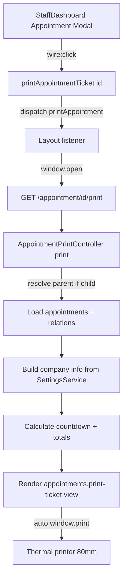

# طباعة بطاقة الحجز (Print Appointment Ticket)

> وثيقة مرجعية كاملة عن ميزة طباعة معلومات الحجز كبطاقة تشغيلية مخصصة لطابعات الفواتير الحرارية مقاس 80mm، أبيض وأسود، متعددة اللغات.

---

## 1. نظرة عامة (Overview)

هذه الميزة تضيف زر **Print Order** داخل `Appointment Modal` في `StaffDashboard`. عند الضغط، يفتح نافذة جديدة تطبع تلقائياً بطاقة بمعلومات الحجز التشغيلية على طابعة حرارية مقاس 80mm.

### الفرق الجوهري بينها وبين طباعة الفاتورة الحالية

| المحور | طباعة الفاتورة (Invoice Print) | طباعة بطاقة الطلب (Order Ticket — جديدة) |
|---|---|---|
| **متى تعمل؟** | فقط بعد الدفع (`canPrintInvoice()`) | لكل الحجوزات غير الملغاة (Pending + Completed) |
| **المصدر** | `Invoice` + `InvoiceTemplate` (نظام template builder ديناميكي) | `Appointment` مباشرة — بلا template builder |
| **هل تولّد رقم؟** | تولّد `invoice_number` وتزيد `print_count` | لا — تستخدم `appointment.number` الموجود |
| **هل تسجّل log؟** | نعم في `PrintLog` (TSE compliance) | لا — هذه ورقة تشغيلية فقط |
| **متطلبات قانونية؟** | نعم (TSE / Fiskaly / تسلسل أرقام) | لا — ورقة عمل داخلية |
| **القالب** | قابل للتخصيص من Filament | قالب ثابت بسيط |

### الغرض التشغيلي

البطاقة تُمنح لمقدم الخدمة قبل بدء التنفيذ، وتحتوي على:
- رقم الدور
- بيانات العميل
- مصدر الحجز (Online / In-Person)
- الخدمات المطلوبة + الأسعار
- إجمالي السعر + حالة الدفع
- الألوان المستخدمة (إن وجدت)
- ملاحظات العميل العامة
- ملاحظات الموظف الخاصة (provider_notes)
- العدّ التنازلي للموعد (Starts in X / In progress / Ended X ago)

---

## 2. البنية المعمارية (Architecture)



### القرارات المعمارية الأساسية

1. **مسار منفصل تماماً عن نظام الفاتورة**
   لا تمر هذه الطباعة عبر `PrintService` ولا `TemplateBuilderService` ولا `PrintLog`. السبب: دمجها يكسر القيود القانونية لـ TSE ويعقّد الكود بلا فائدة.

2. **القالب ثابت وبسيط**
   ليس قابلاً للتخصيص من Filament — لأن مكوّنات البطاقة محدودة ومعروفة سلفاً، ولا حاجة لإضافة line types قابلة للسحب والإفلات.

3. **Resolve to Parent**
   عند طباعة `child appointment`، الـ Controller ينتقل تلقائياً إلى الـ `parent` ويرسم بطاقة موحدة تضم كل أعضاء المجموعة. نفس سلوك طباعة الفاتورة الموحدة.

4. **Business info من `SettingsService`**
   مستقل عن `InvoiceTemplate.company_info`. هذا يحافظ على فصل المسؤوليات: إعدادات العمل عامة وليست خاصة بنظام الفواتير.

5. **Auto-print onLoad**
   نفس آلية الفاتورة (`window.print()` تلقائياً عند تحميل الصفحة)، مع تأخير 300ms ليكتمل rendering القالب أولاً.

---

## 3. الملفات المضافة والمعدّلة

### 3.1 ملفات جديدة (3)

#### `app/Http/Controllers/AppointmentPrintController.php`
**ما هو:** Controller المسؤول عن استقبال طلب الطباعة وإرسال البيانات للقالب.

**الأثر:**
- Endpoint جديد: `GET /appointment/{appointment}/print`
- يحلّ تلقائياً إلى الـ parent إذا كان appointment هو child
- يحمّل العلاقات بـ eager loading لتجنّب N+1
- يحسب countdown (`upcoming` / `in_progress` / `ended` / `unknown`) بناءً على `start_time` و `end_time` و `now()`
- يحسب `grandTotal` لكل المجموعة (parent + children)
- يحدد `isPaid` (true إذا أي appointment في المجموعة لديه دفعة ناجحة)
- يمنع الطباعة للحجوزات الملغاة (`abort(403)`)
- يحدد اتجاه RTL تلقائياً من `app()->getLocale()`

#### `resources/views/appointments/print-ticket.blade.php`
**ما هو:** قالب البطاقة الفعلي بمقاس 80mm.

**الأثر:**
- يستخدم `@page { size: 80mm auto; margin: 2mm }` لضبط حجم الطباعة بدقة
- font: `Courier New / Consolas` monospace (مناسب للحرارية)
- لا ألوان مطلقاً — فقط `#000` على `#fff` (مناسب لطابعات الفواتير)
- يدعم RTL تلقائياً (alignment يتبدّل حسب `$isRtl`)
- يحتوي على:
  - Header: اسم العمل + العنوان + الهاتف + الإيميل
  - Order Number كبير الحجم
  - شارة Linked Group إذا كانت مجموعة (Parent + Children)
  - Date / Time + Countdown
  - بيانات العميل (اسم، هاتف، Registered/Guest)
  - Source (Online / In-Person) مع أيقونة emoji
  - قسم Provider لكل appointment في المجموعة
  - جدول Services + Prices لكل appointment
  - Grand Total + Paid/Unpaid badge
  - قسم Colors Used (مجمّع من كل المجموعة) — swatch بصري + اسم + brand + كمية
  - قسم Customer Notes (deduplicated)
  - قسم Staff Notes (`provider_notes`) — مع اسم الموظف إذا كانت مجموعة
  - Footer: وقت الطباعة + "Thank you"
- يحوي JS صغير لـ `window.print()` التلقائي

#### `docs/PRINT_APPOINTMENT_TICKET.md`
**ما هو:** هذه الوثيقة نفسها.

**الأثر:** مرجع للمطورين الجدد وللذكاء الاصطناعي لفهم الميزة وقراراتها المعمارية وكيفية تعديلها لاحقاً.

---

### 3.2 ملفات معدّلة (6)

#### `routes/web.php`
**ما تغيّر:**
- استيراد `AppointmentPrintController`
- إضافة route جديد:
  ```php
  Route::get('/appointment/{appointment}/print', [AppointmentPrintController::class, 'print'])
      ->name('appointment.print');
  ```
- موضوع داخل نفس group الحماية `auth` التي تحمي `/invoice/{invoice}/print`

**الأثر:**
- URL جديد متاح: `/appointment/{id}/print`
- محمي بـ `auth` middleware — لا يمكن الوصول لمستخدم غير مسجّل دخول
- متاح كـ named route: `route('appointment.print', $id)`

#### `app/Livewire/StaffDashboard.php`
**ما تغيّر:**
- إضافة method جديدة `printAppointmentTicket(int $appointmentId)` بعد `printInvoiceForAppointment`

**الأثر:**
- تتحقق أن الحجز موجود
- ترفض الطباعة إذا كان الحجز ملغى (USER_CANCELLED / ADMIN_CANCELLED) — ترسل `notify` خطأ
- ترسل browser event `printAppointment` مع `appointmentId`
- لا تكسر أي مسار قائم — مضافة بشكل مستقل تماماً

#### `resources/views/livewire/staff-dashboard.blade.php`
**ما تغيّر:**
- إضافة زر "Print Order" بجانب زر "Print Invoice" داخل Appointment Modal

**الأثر:**
- يظهر لكل الحجوزات عدا الملغاة — يستخدم نفس فحص الـ status enum
- لون مميز عن زر الفاتورة (`bg-slate-700` بدل `bg-indigo-600`) لتجنّب الالتباس البصري
- title attribute يوضح حالة "Combined" عند الـ linked bookings
- يحوي شارة `(unified)` إذا كان parent أو child
- أيقونة مختلفة (clipboard) عن طباعة الفاتورة (printer)

#### `resources/views/layouts/dashboard.blade.php`
**ما تغيّر:**
- إضافة listener جديد للحدث `printAppointment` بجانب listener الموجود `printInvoice`

**الأثر:**
- عند تلقي الحدث، يفتح نافذة جديدة بحجم 400×600 على `/appointment/{id}/print`
- نفس آلية فتح نافذة الفاتورة بالضبط — اتساق UX
- لا يؤثر على أي listener قائم

#### `lang/en/dashboard.php`
**ما تغيّر:**
- داخل `print` array: إضافة 3 مفاتيح جديدة (`order_button`, `order_cancelled`, `order_combined_group`)
- إضافة `print_ticket` array كامل (27 مفتاح)

**الأثر:**
- نص الزر: "Print Order"
- نص الخطأ عند الإلغاء: "Cannot print: this appointment is cancelled."
- كل مفاتيح القالب تظهر بالإنجليزية عند `locale === 'en'`

#### `lang/ar/dashboard.php`
**ما تغيّر:** نفس التغييرات بالعربية.

**الأثر:**
- نص الزر: "طباعة الطلب"
- البطاقة تُعرض بالكامل بالعربية مع RTL تلقائي

#### `lang/de/dashboard.php`
**ما تغيّر:** نفس التغييرات بالألمانية.

**الأثر:**
- نص الزر: "Auftrag drucken"
- البطاقة بالألمانية مع LTR

---

## 4. تدفق البيانات (Data Flow)

### 4.1 الـ trigger من الواجهة

```text
User clicks Print Order button
   ↓
wire:click="printAppointmentTicket($id)"
   ↓
StaffDashboard::printAppointmentTicket()
   ↓
$this->dispatch('printAppointment', appointmentId: $id)
   ↓
window.addEventListener('printAppointment', ...)
   ↓
window.open('/appointment/{id}/print', '_blank')
```

### 4.2 على السيرفر

```text
Route → AppointmentPrintController::print(Request, Appointment)
   ↓
Check status: ! USER_CANCELLED && ! ADMIN_CANCELLED  → otherwise abort 403
   ↓
$root = $appointment->parent ?? $appointment   // resolve to group root
   ↓
$root->load([provider, customer, services_record, colorRecords.color, children.*])
   ↓
$appointments = [parent, ...children]
   ↓
$company = SettingsService::get(company_name, address, phone, email)
   ↓
$grandTotal = sum(all appointments total_amount)
   ↓
$isPaid = any appointment payment_status->isSuccessful()
   ↓
$countdown = buildCountdown(earliestStart, latestEnd, now)
   ↓
$locale = app()->getLocale()  /  $isRtl = locale === 'ar'
   ↓
return view('appointments.print-ticket', [...])
```

### 4.3 في القالب

```text
Render company header (center)
   ↓
Render order number large
   ↓
If group: show "Linked group · N bookings"
   ↓
Render date + time + countdown
   ↓
Render customer info
   ↓
Render source (Online / In-Person)
   ↓
Foreach appointment in group:
   ├── Show provider name + booking# (if group)
   └── Show services table with prices
   ↓
Render Grand Total + Paid/Unpaid badge
   ↓
If any colors: render colors section (swatch + name + brand + qty)
   ↓
If any customer notes: render notes (deduplicated)
   ↓
If any provider_notes: render staff notes (per provider if group)
   ↓
Render footer: printed_at + thank you
   ↓
<script>window.print()</script>
```

---

## 5. حالات الحجز والـ Visibility

### 5.1 متى يظهر الزر؟

| `AppointmentStatus` | الزر يظهر؟ |
|---|---|
| `PENDING` (0) | ✅ نعم — هذا هو الاستخدام الرئيسي |
| `COMPLETED` (1) | ✅ نعم — لإعادة طباعة بطاقة موعد منتهٍ |
| `USER_CANCELLED` (-1) | ❌ مخفي |
| `ADMIN_CANCELLED` (-2) | ❌ مخفي |
| `NO_SHOW` (-3) | ✅ نعم — قد يحتاج الموظف بطاقته للتوثيق |

> **ملاحظة:** الفحص في الـ Blade يستخدم `in_array(..., [USER_CANCELLED, ADMIN_CANCELLED])`، لذا `NO_SHOW` لا يُحجب. إذا أردت حجبه لاحقاً، عدّل المصفوفة في الـ Blade والـ Controller وLivewire method.

### 5.2 حماية على مستوى الـ Controller

حتى لو حاول مستخدم خبيث الدخول مباشرة على `/appointment/{id}/print` لحجز ملغى، الـ Controller يرفض بـ `abort(403)`. لا يعتمد فقط على إخفاء الزر.

---

## 6. الـ Linked Bookings (Parent / Children)

نظام BarberBooking يدعم حجوزات مرتبطة: عميل واحد + عدة مقدمي خدمة في نفس اليوم. كل المجموعة تتشارك فاتورة واحدة على الـ parent.

### السلوك في بطاقة الطلب

1. **عند الطباعة من parent:** تطبع بطاقة موحدة فيها كل children.
2. **عند الطباعة من child:** الـ Controller يحلّ إلى الـ parent تلقائياً ويطبع نفس البطاقة الموحدة.
3. **عند الطباعة من standalone:** بطاقة بسيطة لـ appointment واحد فقط.

### كيف تُعرض البطاقة الموحدة

- **رقم الطلب الكبير:** رقم الـ parent (`#APT-...`)
- **شارة Linked Group:** "Linked group · N bookings"
- **لكل appointment في المجموعة:**
  - اسم مقدم الخدمة
  - رقم الحجز الفرعي (لتمييز children)
  - جدول الخدمات الخاص به
- **Grand Total:** مجموع كل appointments في المجموعة
- **Colors:** مجمّعة من كل المجموعة في قسم واحد
- **Customer Notes:** unique deduplicated من كل المجموعة
- **Provider Notes:** لكل مقدم خدمة على حدة (مع اسمه فوق ملاحظته)

---

## 7. الـ Countdown (العدّ التنازلي)

### الحالات الأربع

| الحالة | الشرط | النص |
|---|---|---|
| `upcoming` | `now() < start_time` | "Starts in 1h 23m" |
| `in_progress` | `start_time <= now() <= end_time` | "In progress" |
| `ended` | `now() > end_time` | "Ended 45m ago" |
| `unknown` | لا يوجد `start_time` | لا يظهر السطر |

### المعنى التشغيلي

- **upcoming:** الموظف يعرف كم تبقى ليبدأ التحضير
- **in_progress:** للطباعة أثناء التنفيذ (Walk-in print, إعادة طباعة)
- **ended:** لإعادة طباعة بطاقة موعد منتهٍ مع توضيح أنه انتهى

---

## 8. مصادر البيانات (Data Sources)

| البيان | المصدر | الملاحظة |
|---|---|---|
| اسم العمل + العنوان + الهاتف + الإيميل | `SettingsService::get('company_*')` | جدول `salon_settings` |
| رقم الحجز | `Appointment.number` | يولَّد عبر `BookingService::generateAppointmentNumber()` |
| التاريخ والوقت | `Appointment.appointment_date / start_time / end_time` | datetime casts |
| العميل | `Appointment.customer_name` accessor | يدعم Registered و Guest تلقائياً |
| مصدر الحجز | `Appointment.booking_source` (BookingSource enum) | label + htmlIcon |
| مقدم الخدمة | `Appointment.provider->full_name` | User model |
| الخدمات | `Appointment.services_record` (AppointmentService) | snapshot لكل خدمة |
| الألوان | `Appointment.colorRecords->color` | pivot AppointmentColor |
| ملاحظات العميل | `Appointment.notes` | حقل عادي |
| ملاحظات الموظف | `Appointment.provider_notes` | حقل منفصل عن notes |
| الإجمالي | `sum(appointments.total_amount)` | يُحسب في Controller |
| حالة الدفع | `Appointment.payment_status->isSuccessful()` | PaymentStatus enum |

---

## 9. التصميم البصري (Visual Design)

### مقاس الطباعة الفعلي

- العرض الكلي: `80mm`
- الـ margin: `2mm` من كل جانب
- مساحة الطباعة الفعلية: `~76mm` (مع طرح padding داخلي)

### الخط والألوان

- `font-family: 'Courier New', 'Consolas', monospace` — مقروء على الحرارية
- `font-size: 11px` للنص العادي، `10px` للجداول، `9px` للملاحظات الصغيرة
- اللون: `#000` على `#fff` فقط — بدون أي tones رمادية أو ألوان

### العناصر البصرية الخاصة

- **`hr-double`:** خط أفقي مزدوج للفصل الكبير
- **`hr-single`:** خط متقطع للفصل البسيط
- **`section-title`:** عنوان قسم بـ `border-bottom` وحروف كبيرة
- **`badge`:** شارة Paid/Unpaid بحدود سوداء (Unpaid) أو مملوءة بالأسود (Paid)
- **`swatch`:** مربع لون 10×10px مع حدود سوداء (للألوان المستخدمة)
- **`note-box`:** صندوق بحدود سوداء للملاحظات الطويلة (word-wrap طبيعي)

---

## 10. اختبار يدوي (Manual Testing Checklist)

### A. عبر الـ UI

1. افتح `/dashboard`
2. اضغط على أي appointment card → سيفتح Appointment Modal
3. تأكد من ظهور زر "Print Order" بلون رمادي غامق بجانب باقي الأزرار
4. اضغط الزر → يجب أن يفتح tab جديد على `/appointment/{id}/print`
5. التبويب الجديد يجب أن:
   - يعرض البطاقة بشكل كامل
   - يظهر `window.print()` dialog تلقائياً بعد ~300ms

### B. عبر الـ URL مباشرة

افتح في المتصفح: `http://your-app/appointment/{id}/print`

تحقق من:
- ✅ Header العمل (اسم + عنوان + هاتف)
- ✅ رقم الحجز كبير
- ✅ Date + Time + Countdown يظهر النص الصحيح
- ✅ بيانات العميل (Registered vs Guest)
- ✅ Source (Online / In-Person) مع emoji
- ✅ Provider name
- ✅ جدول الخدمات + الأسعار
- ✅ Grand Total
- ✅ Paid/Unpaid badge بالحالة الصحيحة
- ✅ الألوان (إذا أُضيفت للحجز)
- ✅ Customer Notes (إذا موجودة)
- ✅ Provider Notes (إذا موجودة)
- ✅ Footer: printed_at + thank you

### C. اختبار اللغات

1. حوّل اللغة إلى العربية → افتح بطاقة → تأكد من:
   - الاتجاه RTL
   - كل النصوص بالعربية
   - alignment للجداول معكوس
2. كرر مع الألمانية والإنجليزية

### D. اختبار Linked Bookings

1. أنشئ حجز parent مع 2 children
2. اطبع من parent → يجب أن تظهر كل المجموعة في بطاقة واحدة
3. اطبع من أحد children → يجب أن تظهر نفس البطاقة الموحدة (resolved to parent)
4. تأكد أن:
   - "Linked group · 3 bookings" تظهر
   - كل provider يظهر مع خدماته
   - Grand Total = مجموع الكل
   - Provider Notes منفصلة لكل provider

### E. اختبار حالات الحجز

| الحالة | السلوك المتوقع |
|---|---|
| `PENDING` | الزر يظهر، الطباعة تعمل |
| `COMPLETED` | الزر يظهر، الطباعة تعمل، badge = PAID (غالباً) |
| `USER_CANCELLED` | الزر مخفي، URL مباشر يرجع 403 |
| `ADMIN_CANCELLED` | الزر مخفي، URL مباشر يرجع 403 |

---

## 11. القيود والمناطق الرمادية (Known Limitations)

### 11.1 لا يوجد PrintLog

البطاقة لا تُسجَّل في `print_logs` table. السبب: هذه ورقة تشغيلية وليست مستند قانوني. إذا احتجت لاحقاً تتبّع كم مرة طُبعت بطاقة، يجب إضافة جدول منفصل (مثلاً `appointment_print_logs`) بدلاً من إعادة استخدام `print_logs` الخاص بالفواتير.

### 11.2 لا يوجد تكامل مع PrinterSetting

طباعة الفاتورة تستخدم `PrinterSetting::getDefault()` لتحديد الطابعة المسؤولة. بطاقة الطلب الحالية تعتمد على نافذة المتصفح وطابعة المتصفح الافتراضية. إذا احتجت توجيه البطاقة لطابعة محددة، يجب إضافة دعم `?printer_id=` للـ Controller.

### 11.3 لا يوجد دعم Logo

الـ Header الحالي نصي فقط (اسم العمل + عنوان). إذا أردت إضافة logo:
- أضف `'logo_path' => SettingsService::get('company_logo')` في `$company` array
- في الـ Blade، أضف قبل `company-name`:
  ```html
  @if($company['logo_path'])
      
  @endif
  ```
- ملاحظة: طابعات حرارية كثيرة تطبع logos منخفضة الجودة. اختبر قبل النشر.

### 11.4 لا QR Code

لم يُطلب — لكن البنية تدعم إضافته بسهولة:
- استخدم مكتبة `simple-qrcode` الموجودة بالفعل في المشروع
- ولّد QR من `route('staff.dashboard') . '?appointment=' . $root->id`
- أضف في الـ Blade في الـ Footer

### 11.5 لا يوجد إعادة طباعة "Copy"

طباعة الفاتورة فيها مفهوم "Original / Copy" مع رقم متسلسل. بطاقة الطلب لا تحتاج هذا — يمكن طباعتها أي عدد من المرات بدون أي tracking. إذا احتجت "كم مرة طُبعت بطاقة الطلب"، أضف counter منفصل في `appointments` table.

---

## 12. دليل التعديل الآمن (Safe Modification Guide)

### 12.1 لتغيير تنسيق البطاقة بصرياً

- ابدأ من `resources/views/appointments/print-ticket.blade.php`
- الـ CSS كله inline في `<style>` block — عدّل مباشرة
- لا تلمس `@page { size: 80mm auto }` ما لم تُغيّر حجم الطابعة

### 12.2 لإضافة قسم جديد للبطاقة

- أضف ترجمة في `lang/{ar,de,en}/dashboard.php` تحت `print_ticket.section_*`
- أضف الـ block في الـ Blade بنفس النمط (`<hr class="hr-single">` ثم `<div class="section-title">` ثم المحتوى)
- إذا احتجت بيانات إضافية، أضفها في `AppointmentPrintController::print()` ومرّرها في `view([...])`

### 12.3 لتغيير شروط ظهور الزر

ثلاث نقاط يجب أن تتطابق:
1. الفحص في الـ Blade: `resources/views/livewire/staff-dashboard.blade.php`
2. الفحص في Livewire: `StaffDashboard::printAppointmentTicket()`
3. الفحص في الـ Controller: `AppointmentPrintController::print()`

> **مهم:** لا تكتفي بإخفاء الزر — اترك الفحص في Controller أيضاً لمنع الوصول المباشر عبر URL.

### 12.4 لتغيير مصدر بيانات العمل

غيّر داخل `AppointmentPrintController::print()` السطور:
```php
$company = [
    'name'    => SettingsService::get('company_name', config('app.name')),
    ...
];
```

أمثلة بدائل:
- من `InvoiceTemplate.company_info` الافتراضي
- من branch محدد (إذا أصبح النظام multi-branch فعلياً)
- من tenant/workspace context

### 12.5 لإضافة دعم اختيار الطابعة

1. أضف parameter اختياري للـ route: `/appointment/{appointment}/print?printer_id=X`
2. في الـ Controller، حمّل الـ `PrinterSetting`
3. مرّره للـ view
4. في الـ Blade، أضف auto-print script حسب نوع الطابعة

---

## 13. خريطة المصادر (Source Map)

| ملف | دور |
|---|---|
| `app/Http/Controllers/AppointmentPrintController.php` | Controller الرئيسي |
| `resources/views/appointments/print-ticket.blade.php` | قالب البطاقة 80mm |
| `routes/web.php` (line ~74) | تعريف الـ route |
| `app/Livewire/StaffDashboard.php::printAppointmentTicket()` | trigger من الواجهة |
| `resources/views/livewire/staff-dashboard.blade.php` (Print Order button) | الزر في Appointment Modal |
| `resources/views/layouts/dashboard.blade.php` (listener) | المستمع لحدث `printAppointment` |
| `lang/{ar,de,en}/dashboard.php` (مفاتيح `print_ticket.*` و `print.order_*`) | الترجمات |
| `app/Services/SettingsService.php` (موجود مسبقاً) | مصدر بيانات الشركة |
| `app/Enum/BookingSource.php` (موجود مسبقاً) | `label()` و `htmlIcon()` لمصدر الحجز |
| `app/Enum/AppointmentStatus.php` (موجود مسبقاً) | فحص الإلغاء |
| `app/Models/Appointment.php` (موجود مسبقاً) | accessors: `customer_name`, `customer_phone`, `provider`, `colorRecords`, `services_record` |

---

## 14. ملخص تنفيذي للذكاء الاصطناعي (AI Summary)

- ميزة منفصلة تماماً عن نظام طباعة الفاتورة — **لا تخلط بينهما**
- المسار: `StaffDashboard button → Livewire dispatch → layout listener → /appointment/{id}/print → Controller → Blade view → window.print()`
- المحتوى ثابت (لا template builder) — كل التخصيص في الـ Blade مباشرة
- يدعم Parent/Children تلقائياً عبر `parent ?? $this` في الـ Controller
- يدعم 3 لغات (ar/de/en) مع RTL تلقائي للعربية
- لا يولّد invoice_number، لا يسجّل في PrintLog، لا يتفاعل مع TSE/Fiskaly
- آمن: الحجوزات الملغاة محجوبة على ثلاث مستويات (Blade + Livewire + Controller)
- البيانات: مباشرة من `Appointment` model + `SettingsService` للترويسة
- الـ Auto-print يعمل onLoad تلقائياً — نفس آلية الفاتورة بالضبط

---

## 15. الفروقات الجوهرية مع طباعة الفاتورة — جدول مرجعي سريع

| | Invoice Print | Order Print |
|---|---|---|
| Route | `/invoice/{invoice}/print` | `/appointment/{appointment}/print` |
| Controller | `PrintController` | `AppointmentPrintController` |
| Service Layer | `PrintService` + `TemplateBuilderService` | لا يوجد — render مباشر |
| View | `invoices.template-builder` (dynamic) | `appointments.print-ticket` (static) |
| Livewire method | `printInvoiceForAppointment()` | `printAppointmentTicket()` |
| Browser event | `printInvoice` | `printAppointment` |
| Layout listener | موجود مسبقاً | جديد، بجانب الموجود |
| Translation namespace | `dashboard.print.*` | `dashboard.print_ticket.*` + `dashboard.print.order_*` |
| Button color | `bg-indigo-600` | `bg-slate-700` |
| Button icon | Printer SVG | Clipboard SVG |
| Visibility rule | `canPrintInvoice()` (paid only) | non-cancelled |
| Logs to PrintLog | ✅ | ❌ |
| TSE/Fiskaly | ✅ | ❌ |
| Customizable template | ✅ (Filament) | ❌ |
| 80mm size | يعتمد على Template | ✅ ثابت |
| B/W only | يعتمد على Template | ✅ ثابت |
