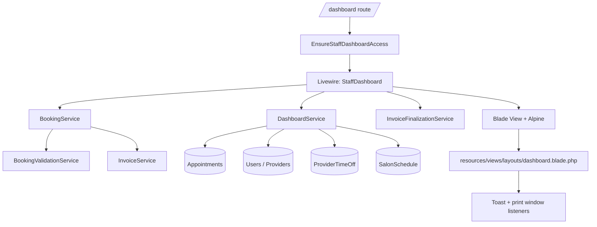

# StaffDashboard Documentation

> وثيقة مرجعية عميقة ومبنية على قراءة مباشرة للكود الحالي، هدفها أن تمنح أي AI أو مطور فهمًا دقيقًا جدًا لصفحة `StaffDashboard` بكل ما فيها: الواجهة، الحالة، تدفقات الحجز، الدفع، الإجازات، الـ timeline، القواعد التشغيلية، والقيود الحالية.

---

## 1. Scope

هذه الوثيقة تغطي slice كامل خاص بصفحة:

- `app/Livewire/StaffDashboard.php`
- `resources/views/livewire/staff-dashboard.blade.php`

مع الاعتماد المباشر على الملفات التالية لفهم السلوك الفعلي:

- `app/Services/DashboardService.php`
- `app/Services/BookingService.php`
- `app/Services/BookingValidationService.php`
- `app/Services/InvoiceFinalizationService.php`
- `app/Services/InvoiceService.php`
- `app/Services/ServiceAvailabilityService.php`
- `app/Models/Appointment.php`
- `app/Models/AppointmentService.php`
- `app/Models/ProviderTimeOff.php`
- `app/Enum/AppointmentStatus.php`
- `app/Enum/PaymentStatus.php`
- `app/Http/Middleware/EnsureStaffDashboardAccess.php`
- `routes/web.php`
- `resources/views/layouts/dashboard.blade.php`
- `database/seeders/RoleSeeder.php`
- `Agent.md`
- `docs/BOOKING_FLOW.md`

هذه الوثيقة لا تشرح فقط "كيف تبدو الصفحة"، بل تشرح أيضًا "من أين تأتي البيانات" و"لماذا تعمل هكذا" و"أين توجد القيود أو المناطق الرمادية".

---

## 2. One-Sentence Mental Model

`StaffDashboard` هي شاشة تشغيل يومية مخصصة للطاقم/الإدارة، مبنية بـ Livewire + Blade + Alpine، وتجمع في واجهة واحدة:

- عرض الجدول اليومي على شكل `timeline`
- إنشاء حجز سريع
- تعديل/إلغاء/حذف الحجز
- تحصيل الدفع وإنهاء الفاتورة
- إضافة إجازات أو انقطاع لمقدم الخدمة
- تبديل اللغة
- مراقبة اليوم الحالي مع تحديث دوري تلقائي

هي ليست API route للعميل، وليست Filament Resource تقليدية، بل شاشة تشغيل مخصصة فوق منطق الأعمال الموجود مسبقًا في خدمات الحجز والفواتير.

---

## 3. Where It Lives

### 3.1 Route

الصفحة تُعرَض من خلال route مباشر في `routes/web.php`:

```php
Route::middleware(['web', EnsureStaffDashboardAccess::class])->group(function () {
    Route::livewire('/dashboard', \App\Livewire\StaffDashboard::class)
        ->name('staff.dashboard');
});
```

يوجد أيضًا route لتبديل اللغة داخل نفس group:

```php
Route::get('/dashboard/language/{code}', function (string $code) {
    // stores locale in session and redirects back
})->name('staff.dashboard.language');
```

### 3.2 Access Control

الدخول لا يعتمد على Sanctum ولا على auth الافتراضي فقط، بل يعتمد على `filament()->auth()` داخل middleware مخصص:

```php
if (! $auth->check()) {
    return redirect()->route('filament.admin.auth.login');
}

if (! $auth->user()->can('StaffDashboard:access')) {
    abort(403);
}
```

### 3.3 Important Access Note

من `database/seeders/RoleSeeder.php`:

- صلاحية `StaffDashboard:access` موجودة ضمن صلاحيات `admin`
- لا تظهر ضمن قائمة صلاحيات `provider` الافتراضية في الـ seeder الحالي

هذا يعني أن الاسم "StaffDashboard" قد يوحي أنها للموظف عمومًا، لكن الإعداد الافتراضي الحالي للـ seeders يمنح الوصول للإدارة فقط ما لم تُمنح الصلاحية يدويًا لاحقًا.

---

## 4. High-Level Architecture



تقسيم المسؤوليات باختصار:

- `StaffDashboard.php`: حالة الصفحة، تنفيذ الأوامر، تنسيق البيانات للعرض
- `staff-dashboard.blade.php`: بناء الواجهة، التفاعلات المحلية، timeline math، Alpine local state
- `DashboardService`: تزويد الشاشة بالبيانات الجاهزة للعرض واختبارات التوفر
- `BookingService`: إنشاء الحجز نفسه مع الفاتورة المسودة
- `BookingValidationService`: قواعد التحقق الفعلي للحجز
- `InvoiceFinalizationService`: إنهاء الدفع وتحويل الفاتورة من Draft إلى Paid
- `dashboard.blade.php` layout: toast notifications + listener لطباعة الفاتورة

---

## 5. What The Dashboard Actually Does

الصفحة تغطي 9 وظائف تشغيلية رئيسية:

1. اختيار اليوم من تقويم جانبي شهري.
2. إظهار/إخفاء مقدمي الخدمة في الـ timeline.
3. عرض اليوم كساعات/تدريجات مع مواعيد وإجازات.
4. إنشاء حجز بسرعة من داخل الداشبورد.
5. فتح تفاصيل أي موعد موجود.
6. تعديل وقت ومدة الموعد.
7. إلغاء أو حذف الموعد إذا كان غير مدفوع وغير مكتمل.
8. تحصيل الدفع وإنهاء الفاتورة وفتح نافذة الطباعة.
9. إضافة `time off` يوم كامل أو ساعي لمقدم خدمة.

وأضيف مؤخرًا أيضًا:

10. التحكم المحلي في `timeline scale` بين `10` و`15` و`30` دقيقة.

---

## 6. Files and Their Real Responsibility

### 6.1 `app/Livewire/StaffDashboard.php`

هو الـ orchestrator الرئيسي. مسؤول عن:

- تعريف public state للصفحة
- استدعاء `DashboardService`
- تنفيذ العمليات التي تغيّر البيانات
- إعادة بناء `timelineData`
- فتح وإغلاق النوافذ المختلفة
- إرسال browser events مثل `notify`, `booking-saved`, `printInvoice`

### 6.2 `resources/views/livewire/staff-dashboard.blade.php`

هو الواجهة الكاملة. يحتوي:

- Sidebar calendar
- قائمة مقدمي الخدمة
- timeline columns
- appointment cards
- modals
- Alpine app local state
- الحسابات البصرية للـ timeline وgrid والdrag

### 6.3 `app/Services/DashboardService.php`

هذه الخدمة لا تنشئ حجوزات، بل تغذي الداشبورد ببيانات مناسبة للعرض، مثل:

- providers + work/day-off status
- appointments لليوم
- time offs
- salon schedule
- monthly booking counts
- categories / services / customers preload
- available providers for service at a chosen time

### 6.4 `app/Services/BookingService.php`

منطق إنشاء الحجز نفسه. الصفحة لا تحفظ الحجز مباشرة في الـ model، بل تبني payload ثم ترسله لهذه الخدمة.

### 6.5 `app/Services/InvoiceFinalizationService.php`

يُنهي الفاتورة المسودة، يضيف payment record، يحدّث `payment_status`، ويضيف placeholder TSE data حاليًا.

---

## 7. Livewire State Model

### 7.1 Date & Calendar State

```php
public string $selectedDate;
public array $selectedProviderIds = [];
public int $calendarYear;
public int $calendarMonth;
```

هذه المجموعة تتحكم في:

- اليوم المعروض على الـ timeline
- الشهر الحالي في التقويم الجانبي
- مجموعة مقدمي الخدمة الظاهرين في الجدول

### 7.2 Modal Visibility State

```php
public bool $showBookingModal = false;
public bool $showAppointmentModal = false;
public bool $showPaymentModal = false;
public bool $showTimeOffModal = false;
```

ملاحظة مهمة:

- `showAppointmentModal`, `showPaymentModal`, `showTimeOffModal` تُدار من Livewire مباشرة
- `showBookingModal` موجودة في Livewire، لكن المسار المستخدم فعليًا في الواجهة الحالية يعتمد على Alpine local state أكثر من اعتماد Livewire على هذا المتغير

### 7.3 Booking Form State

```php
public string $customerType = 'existing';
public ?int $selectedCustomerId = null;
public string $guestName = '';
public string $guestPhone = '';
public string $guestEmail = '';
public string $customerSearch = '';
public array $bookingServices = [];
public string $bookingNotes = '';
```

هذه المجموعة تبدو كأنها النموذج الرئيسي للحجز، لكن في التطبيق الحالي هناك مساران:

- المسار الفعلي المستخدم في Blade: Alpine object `booking` ثم `saveBookingFromAlpine()`
- مسار Livewire الأقدم: `saveBooking()` مع الاعتماد على هذه الـ public properties

### 7.4 Selected Appointment / Editing State

```php
public ?int $selectedAppointmentId = null;
public string $editStartTime = '';
public int $editDuration = 0;
```

تُستخدم عند فتح appointment modal وتعديل وقت الموعد.

### 7.5 Payment State

```php
public float $paymentAmount = 0;
public string $paymentType = '2';
```

ملاحظة مهمة:

- `paymentType = '2'` يعني `PAID_ONSTIE_CASH`
- `paymentType = '3'` يعني `PAID_ONSTIE_CARD`

القيم هنا strings وليست enum instances، لأن المودال يتعامل مع radio values نصية.

### 7.6 Time Off State

```php
public ?int $timeOffProviderId = null;
public string $timeOffType = '1';
public string $timeOffStartDate = '';
public string $timeOffEndDate = '';
public string $timeOffStartTime = '';
public string $timeOffEndTime = '';
public ?int $timeOffReasonId = null;
```

`timeOffType`:

- `1` = Full day
- `0` = Hourly

---

## 8. Component Lifecycle

### 8.1 `boot(DashboardService $dashboardService)`

يحفظ الخدمة injected داخل property:

```php
$this->dashboardService = $dashboardService;
```

### 8.2 `mount()`

يهيّئ الشاشة أول مرة:

- `selectedDate = today`
- `calendarYear`, `calendarMonth`
- يجلب جميع providers من `DashboardService::getProviders()`
- يفعّلهم جميعًا افتراضيًا داخل `selectedProviderIds`
- يضيف service row فارغًا إلى نموذج الحجز

### 8.3 `render()`

كل render يقوم بالآتي:

1. `getProvidersWithStatus($selectedDate)`
2. `getTimelineDataFromProviders($allProviders)`
3. `getCalendarData()`
4. إذا كان هناك appointment محدد، يجلب details كاملة
5. يمرر `preloadedData` و`activeLanguages` إلى view
6. يرد view مع layout خاص:

```php
return view('livewire.staff-dashboard', [...])->layout('layouts.dashboard');
```

### 8.4 Caching in Render Dependencies

- `getActiveLanguages()` يستخدم cache key ثابت: `dashboard_active_languages`
- `getPreloadedData()` يستخدم cache key يحتوي locale:

```php
'dashboard_preloaded_data_' . app()->getLocale()
```

هذا مهم لأن القيم المعروضة مترجمة حسب اللغة.

---

## 9. UI Anatomy

### 9.1 Top Header

الجزء العلوي يحتوي:

- اسم التطبيق
- رابط `/dashboard`
- رابط `/admin`
- language switcher
- notifications placeholder
- avatar circle مبني من أول حرف من اسم المستخدم

### 9.2 Sidebar

يتكون من 3 أجزاء:

1. تقويم شهري صغير
2. قائمة الفريق / providers مع checkbox
3. أزرار:
   - `Add Booking`
   - `Add Time Off`

### 9.3 Main Date Header

يحتوي:

- التاريخ المختار بشكل مقروء
- زر `Today` إذا لم يكن اليوم الحالي
- badge اليوم الحالي إذا كان التاريخ هو اليوم
- dropdown للتحكم بـ `timeline scale`
- مؤشر loading
- ساعات دوام الصالون لليوم أو badge `Day Off`

### 9.4 Timeline Body

يتكون من:

- عمود أوقات يسارًا
- عمود لكل provider
- grid lines
- current time marker
- time off blocks
- appointment cards
- drag overlay لإنشاء الحجز

### 9.5 Modals

توجد 4 مودالات:

- Booking modal
- Appointment details modal
- Payment modal
- Time off modal

---

## 10. Layout-Level Behavior Outside The Component

`resources/views/layouts/dashboard.blade.php` مهم جدًا لفهم السلوك النهائي، لأنه يحتوي listeners browser-level:

```js
window.addEventListener('notify', (e) => {
    // renders toast
});

window.addEventListener('printInvoice', (e) => {
    window.open(`/invoice/${invoiceId}/print`, '_blank', 'width=400,height=600');
});
```

هذا يعني أن `StaffDashboard` نفسه لا يرسم toast ولا يطبع الفاتورة مباشرة، بل يرسل event ويعتمد على layout لالتقاطه.

---

## 11. Timeline Rendering Model

### 11.1 Source Data

الـ timeline لا يُبنى مباشرة من models داخل Blade، بل من array منسقة بواسطة:

```php
getTimelineDataFromProviders($allProviders)
```

الـ result shape:

```php
[
  'is_open' => bool,
  'providers' => [...],
  'appointments' => [providerId => [...]],
  'time_offs' => [providerId => [...]],
  'start_time' => 'HH:MM',
  'end_time' => 'HH:MM',
]
```

### 11.2 Timeline Height Model

في النسخة الحالية، ارتفاع الـ timeline أصبح client-side ويعتمد على اختيار التدريج.

داخل Alpine:

```js
timelineBaseSlotHeight: 45,
timelineScaleOptions: [10, 15, 30],
timelineScale: 15,
```

والحساب الأساسي:

```js
pixelsPerMinute() {
    return this.timelineBaseSlotHeight / this.timelineScale;
}
```

المعنى العملي:

- كل تدريجة مختارة لها ارتفاع بصري ثابت = `45px`
- إذا كان scale = `30`، فكل 30 دقيقة = 45px
- إذا كان scale = `15`، فكل 15 دقيقة = 45px، وبالتالي يتمدّد طول اليوم إلى الضعف مقارنة بـ 30
- إذا كان scale = `10`، يتمدّد أكثر

هذا التغيير موجود خصيصًا لتحسين وضوح الحجوزات القصيرة مثل 5 أو 10 دقائق.

### 11.3 Timeline Scale Persistence

التدريج يُحفظ في المتصفح عبر:

```js
timelineScaleStorageKey: 'staff-dashboard-timeline-scale'
```

باستخدام `localStorage`.

### 11.4 What Changes When Scale Changes

عند تغيير scale، يتأثر:

- ارتفاع عمود الأوقات
- ارتفاع أعمدة providers
- تموضع الخطوط الشبكية
- تموضع مؤشر الوقت الحالي
- تموضع وارتفاع appointment cards
- تموضع وارتفاع time off blocks
- step لحقول الوقت داخل booking modal
- step لحقل تعديل وقت الموعد
- snap عند السحب على الـ timeline
- snap لوقت البداية الافتراضي عند فتح booking modal

### 11.5 Time Labels

الوقت على يسار الـ timeline يعرض وقت كل تدريجة، لا كل ساعة فقط:

```js
timelineLabelMinutes(totalMinutes)
```

ثم:

```js
formatTimelineMinute(offsetMinutes, startTime)
```

### 11.6 Appointment Cards

كل card يُرسم بحسب:

- `start_time`
- `end_time`
- `status`
- `payment_status`
- `service_color_code`

ويتم تلوينها عبر:

- background حسب `status`
- left border حسب `status`
- bottom stripe حسب `service_color_code`

ولا يوجد الآن حد أدنى اصطناعي للارتفاع؛ الارتفاع يتبع مدة الموعد فعليًا.

### 11.7 Current Time Marker

إذا كان `selectedDate === today`، يظهر خط أحمر أفقي في مكان الوقت الحالي.

### 11.8 Drag-to-Create

الـ drag يعمل على مستوى العمود نفسه:

- `mousedown` يبدأ السحب
- `mousemove` يحدّث نهاية السحب
- `mouseup` يحسب start time ويستدعي `openBookingModalLocal(providerId, startTime)`

الحساب يعتمد على scale الحالي:

```js
const minutesFromStart = Math.round(topY / pixelsPerMinute / this.timelineScale) * this.timelineScale;
```

أي أن الـ snap دائمًا على التدريج المختار.

---

## 12. Data Contract of `timelineData`

### 12.1 Provider Item Shape

من `DashboardService::getProvidersWithStatus()`:

```php
[
  'id' => int,
  'name' => string,
  'avatar' => ?string,
  'is_work_day' => bool,
  'has_day_off' => bool,
  'schedule' => ?[
    'start_time' => mixed,
    'end_time' => mixed,
  ],
  'booking_count' => int,
]
```

### 12.2 Appointment Item Shape

من `StaffDashboard::getTimelineDataFromProviders()`:

```php
[
  'id' => int,
  'number' => string,
  'start_time' => 'HH:MM',
  'end_time' => 'HH:MM',
  'duration' => int,
  'customer_name' => string,
  'has_account' => bool,
  'services' => string,
  'status' => int,
  'status_label' => string,
  'payment_status' => int,
  'total_amount' => float,
  'service_color_code' => ?string,
]
```

### 12.3 Time Off Item Shape

```php
[
  'id' => int,
  'type' => int,
  'start_time' => 'HH:MM',
  'end_time' => 'HH:MM',
  'reason' => string,
]
```

---

## 13. DashboardService Deep Dive

### 13.1 `getProviders()`

يجلب users الذين لديهم role = `provider` و`is_active = true`.

### 13.2 `getProvidersWithStatus(string $date)`

يجمع 3 أنواع بيانات ليوم محدد:

- هل لدى المزود scheduled work في ذلك اليوم؟
- هل لديه full day off؟
- كم عدد الحجوزات لذلك اليوم؟

ويعيد array مختصر مناسب للـ sidebar والـ timeline header.

مهم: عدد الحجوزات يعتمد على appointments التي:

- `created_status = 1`
- ليست `USER_CANCELLED`
- ليست `ADMIN_CANCELLED`

### 13.3 `getAppointmentsForDate()`

يجلب appointments لليوم مع eager loading:

```php
with(['services', 'services_record.service', 'customer', 'provider', 'invoice'])
```

ويستبعد فقط حالتي الإلغاء الإداري/العميل.

هذا يعني أن:

- `Pending` يظهر
- `Completed` يظهر
- `No Show` يظهر
- الملغي لا يظهر

### 13.4 `getTimeOffsForDate()`

يجلب نوعين:

- Full day overlaps with selected date
- Hourly entries on selected date

### 13.5 `getSalonScheduleForDate()`

يجلب schedule من أول branch active فقط.

هذا يعني أن الداشبورد الحالي فعليًا single-branch oriented حتى لو كان النظام multi-branch ready.

### 13.6 `getBookingCountsForMonth()`

يستخدم calendar sidebar لإظهار العدادات على الأيام.

### 13.7 `getAllServicesGrouped()`

يرجع preload مناسب لـ Alpine:

- categories مترجمة (`translated_name`)
- services مترجمة (`translated_name`)
- price / discount / duration / category_id

### 13.8 `getAllCustomers()`

يرجع array جاهز للبحث المحلي في Alpine.

### 13.9 `getAvailableProvidersForServiceAtTime()`

هذه الدالة هي الأهم في booking modal الحالي.

الـ flow الحالي ليس:

> اختر خدمة ثم اعرض كل slots

بل هو أقرب إلى:

> اختر خدمة + وقت، ثم اعرض أي providers متاحين في هذا الوقت

هذه الدالة تتحقق من:

- provider works that day
- الوقت ضمن schedule
- لا يوجد full day off
- لا يوجد hourly time off conflict
- لا يوجد appointment conflict

وتعيد فقط providers المتاحين لهذا slot.

### 13.10 `getAppointmentDetails()`

يحمّل details أوسع للمودالات:

```php
with([
  'services',
  'services_record',
  'customer',
  'provider',
  'invoice',
  'invoice.items',
])
```

---

## 14. Booking Creation Flow (Actual Current Flow)

### 14.1 Important Architectural Fact

المسار المستخدم فعليًا في الواجهة الحالية هو:

```text
Alpine booking object
    -> submitBooking()
    -> $wire.saveBookingFromAlpine(data)
    -> BookingService::createBooking(...)
```

أما `saveBooking()` في `StaffDashboard.php` فهو موجود لكنه ليس المسار الرئيسي المستخدم في الـ Blade الحالية.

### 14.2 Opening The Booking Modal

المسار الفعلي من الزر أو من السحب:

```js
openBookingModalLocal(providerId = null, startTime = null)
```

وظيفتها:

- reset local booking state
- إذا وصل `startTime` من الـ timeline، يتم snap على scale الحالي
- إذا لم يصل وقت، تأخذ الوقت الحالي ثم snap
- إذا وصل providerId، يتم حفظه كـ `_preselectedProvider`

### 14.3 Customer Mode

يدعم نوعين:

- `existing`
- `guest`

في existing customer:

- البحث local داخل `preloaded.customers`
- لا يوجد server round-trip لكل حرف

في guest:

- الاسم
- الهاتف
- الإيميل اختياري

### 14.4 Service Selection UX

لكل service row:

1. اختيار category
2. اختيار service
3. عند تغيير الخدمة:
   - يحمّل duration من الخدمة
   - يحمّل price من `discount_price || price`
   - يصفر provider السابق
4. المستخدم يحدد `start_time`
5. بعد وجود `service_id + start_time` يتم تحميل providers المتاحين

### 14.5 `saveBookingFromAlpine(array $data)`

هذه الدالة:

1. تنظف الخدمات غير المكتملة
2. تبني `bookingData`
3. تميز بين customer existing أو guest
4. تمرر services إلى `BookingService`

النقطة الأهم في النسخة الحالية:

```php
'payment_method' => 'cash',
'is_confirmed' => true,
'mark_as_paid' => false,
```

هذا تم تصميمه لحل مشكلة كانت تجعل حجوزات الداشبورد الجديدة تظهر كأنها مدفوعة مباشرة.

المعنى الآن:

- الموعد `confirmed` لكي يحجز الوقت ويظهر على الجدول
- لكنه `unpaid` حتى يتم دفعه فعليًا من payment modal لاحقًا

### 14.6 `BookingService::createBooking()`

الدالة تستخرج:

```php
$isConfirmed = $bookingData['is_confirmed'] ?? ($paymentMethod == 'cash');
$markAsPaid = $bookingData['mark_as_paid'] ?? ($paymentMethod == 'cash');
```

ثم داخل transaction:

```php
$createdStatus = $isConfirmed ? 1 : 0;
$paymentStatus = $markAsPaid
    ? PaymentStatus::PAID_ONSTIE_CASH
    : PaymentStatus::PENDING;
```

الحجز الناتج من الداشبورد الحالي يكون عادة:

- `status = AppointmentStatus::PENDING`
- `created_status = 1`
- `payment_status = PaymentStatus::PENDING`

### 14.7 Validation Layer

`BookingService` لا يثق بالواجهة، بل يمرر كل شيء إلى `BookingValidationService` للتحقق من:

- صحة البيانات الأساسية
- حد الحجوزات اليومي
- أن المزود يقدم هذه الخدمة
- التسلسل الزمني بين الخدمات المتعددة
- عدم تضارب الوقت
- عدم تكرار حجز لنفس العميل/الهاتف
- عدم الحجز في الماضي
- احترام `book_buffer`

### 14.8 Draft Invoice On Booking

بعد إنشاء appointment وappointment services:

```php
$InvoiceService->createDtaftInvoiceFromAppointment($appointment, 'cash', 0);
```

إذًا كل حجز جديد من الداشبورد ينشئ draft invoice مباشرة، حتى لو لم يتم الدفع بعد.

ملاحظة:

- اسم method فيه typo تاريخي: `createDtaftInvoiceFromAppointment`

---

## 15. Appointment Details Flow

### 15.1 Opening

الضغط على أي appointment card يستدعي:

```php
openAppointmentModal(int $appointmentId)
```

الدالة:

- تحفظ `selectedAppointmentId`
- تجلب details من `DashboardService`
- تملأ `editStartTime` و`editDuration`
- تفتح modal

### 15.2 What The Modal Shows

- booking number
- customer name
- services list
- provider name
- colored badge for appointment status
- colored badge for payment status
- fields لتعديل الوقت والمدة

### 15.3 Status Rendering

الـ modal يبني badge maps محليًا داخل Blade باستخدام `match` على enum values.

### 15.4 Action Visibility Rules

زرّا `Cancel Appointment` و`Delete` يظهران فقط إذا:

```php
!in_array(payment_status, [1,2,3]) && status !== 1
```

أي:

- الموعد ليس مدفوعًا
- وليس مكتملًا

زر `Pay` يظهر فقط إذا:

```php
status === 0
```

أي عندما يكون الموعد `Pending`.

---

## 16. Appointment Update Flow

### 16.1 Method

```php
updateAppointment()
```

### 16.2 What It Updates

تحديث مباشر على جدول appointments:

- `start_time`
- `end_time`
- `duration_minutes`

ثم إذا كان لدى الموعد services_record:

- يحدث فقط أول service record ليأخذ `duration_minutes` الجديدة

### 16.3 Important Limitation

هذه العملية لا تعيد حساب:

- تسلسل الخدمات المتعددة
- end_time لكل service فرعي
- invoice totals
- invoice items
- provider conflict validation قبل الحفظ

إذًا التعديل الحالي هو تعديل خفيف وسريع على الموعد الرئيسي، وليس reschedule workflow كامل.

---

## 17. Cancel Flow

### 17.1 Method

```php
cancelAppointment()
```

### 17.2 Guard Rule

لا يمكن إلغاء موعد إذا كان:

- `payment_status` من القيم `[1,2,3]`
- أو `status === COMPLETED`

### 17.3 Result

يتم تحديث الموعد إلى:

```php
status = AppointmentStatus::ADMIN_CANCELLED
cancelled_at = now()
cancellation_reason = 'Cancelled by staff'
```

ثم يغلق المودال ويرسل toast.

---

## 18. Delete Flow

### 18.1 Method

```php
deleteAppointment()
```

### 18.2 Guard Rule

نفس قاعدة الإلغاء: لا حذف للمدفوع أو المكتمل.

### 18.3 Transaction Steps

داخل transaction:

1. حذف `invoice.items`
2. حذف `invoice.payments`
3. حذف invoice نفسها
4. `services()->detach()`
5. `services_record()->delete()`
6. حذف appointment

### 18.4 Note

هذا حذف فعلي hard delete، وليس soft delete.

---

## 19. Payment Flow

### 19.1 Opening The Modal

```php
openPaymentModal(int $appointmentId)
```

يحمّل:

- `selectedAppointmentId`
- `paymentAmount = appointment.total_amount`
- `paymentType = '2'` افتراضيًا (cash)

ثم يغلق appointment modal ويفتح payment modal.

### 19.2 `processPayment()`

التدفق:

1. تحميل appointment مع invoice
2. إذا لا توجد invoice، ينشئ draft invoice أولًا
3. إذا تغيّر `paymentAmount` يدويًا، يحدّث `invoice.total_amount`
4. يستدعي `InvoiceFinalizationService::finalizeDraftInvoice(...)`
5. بعد العودة، يحدّث appointment status إلى `COMPLETED`
6. يرسل toast نجاح
7. إذا final invoice لها رقم، يرسل event `printInvoice`

### 19.3 `InvoiceFinalizationService::finalizeDraftInvoice()`

هذه الخدمة:

- تتحقق أن invoice الحالية `DRAFT`
- تولّد invoice number
- تضيف metadata في `invoice_data`
- تستدعي `updateAppointmentStatus()` لتحديث `payment_status`
- تنشئ payment record
- تسجل log

### 19.4 TSE State

رغم أن `applyTse = true` يُمرر من الداشبورد، فالخدمة الحالية تطبّق placeholder data فقط؛ التكامل الفعلي مع TSE ليس منفذًا بعد.

### 19.5 Print Trigger

الطباعة لا تتم من داخل Livewire مباشرة، بل عبر browser event:

```php
$this->dispatch('printInvoice', invoiceId: $finalizedInvoice->id);
```

ثم layout يفتح `/invoice/{id}/print` في نافذة جديدة.

### 19.6 Important Accounting Caveat

إذا غيّر المستخدم `paymentAmount` يدويًا، الكود الحالي يحدث فقط:

```php
$invoice->update(['total_amount' => $this->paymentAmount]);
```

بدون إعادة بناء invoice items أو subtotal/tax بشكل صريح داخل هذا المسار.

هذا مناسب عمليًا لحالات خصم سريعة، لكنه ليس مسار accounting-perfect كامل.

---

## 20. Time Off Flow

### 20.1 Opening

```php
openTimeOffModal()
```

يفرغ النموذج ويضبط تاريخ البداية والنهاية على `selectedDate`.

### 20.2 Saving

```php
saveTimeOff()
```

يبني payload فيه:

- `user_id`
- `type`
- `start_date`
- `end_date`
- `reason_id`

وإذا كان النوع ساعي يضيف:

- `start_time`
- `end_time`

ثم ينفذ:

```php
ProviderTimeOff::create($data)
```

### 20.3 Time Off Types

من `ProviderTimeOff` model:

- `TYPE_HOURLY = 0`
- `TYPE_FULL_DAY = 1`

---

## 21. Alpine Frontend App Deep Dive

داخل `staff-dashboard.blade.php` توجد دالة:

```js
function dashboardApp() { ... }
```

وهي مسؤولة عن:

- إدارة polling timer
- booking local state
- timeline scale local state
- snap logic
- drag-create logic
- customer filtering
- service/category local lookups
- async loading of available providers

### 21.1 Polling

يوجد polling كل 3 ثواني عبر `$wire.$refresh()` عندما لا تكون booking modal مفتوحة.

في أعلى الـ root element:

```html
x-effect="if (!showBookingModal) { clearInterval(_pollTimer); _pollTimer = setInterval(() => $wire.$refresh(), 3000); } else { clearInterval(_pollTimer); }"
x-init="_pollTimer = setInterval(() => $wire.$refresh(), 3000)"
```

المقصود العملي:

- الصفحة تحدث نفسها دوريًا
- أثناء تحرير booking local modal يتم إيقاف polling حتى لا يربك الحالة

### 21.2 Preloaded Data

```js
preloaded: window.__dashboardPreloaded || @json($preloadedData)
```

تتضمن:

- categories
- services
- customers

والهدف تقليل round-trips أثناء فتح booking modal.

### 21.3 Customer Search

`filteredCustomers()` يعمل local filter فقط على `preloaded.customers`.

### 21.4 Service Chain Helpers

- `servicesForCategory(categoryId)`
- `onServiceChange(bs)`
- `addBookingService()`
- `loadProviders(bIndex)`
- `loadProvidersForService(bs)`

### 21.5 Scale-Sensitive Time Helpers

- `pixelsPerMinute()`
- `minuteToPixels(minutes)`
- `timelineColumnStyle(totalMinutes)`
- `timelineGridLineStyle(minute)`
- `timelineMarkerStyle(offsetMinutes)`
- `timelineBlockStyle(offsetMinutes, durationMinutes)`
- `blockVisible(durationMinutes, thresholdPixels)`
- `snapTime(time)`

هذه المجموعة هي قلب سلوك timeline الجديد.

---

## 22. Appointment and Payment Status Semantics

### 22.1 AppointmentStatus

من `app/Enum/AppointmentStatus.php`:

| Value | Enum | Meaning in dashboard |
|---|---|---|
| `0` | `PENDING` | موعد قائم لم يُستكمل بعد |
| `1` | `COMPLETED` | تم إنهاؤه / دفعه غالبًا |
| `-1` | `USER_CANCELLED` | ملغي من العميل |
| `-2` | `ADMIN_CANCELLED` | ملغي من الإدارة |
| `-3` | `NO_SHOW` | لم يحضر |

### 22.2 PaymentStatus

من `app/Enum/PaymentStatus.php`:

| Value | Enum | Meaning |
|---|---|---|
| `0` | `PENDING` | غير مدفوع |
| `1` | `PAID_ONLINE` | مدفوع أونلاين |
| `2` | `PAID_ONSTIE_CASH` | مدفوع نقدًا بالموقع |
| `3` | `PAID_ONSTIE_CARD` | مدفوع بطاقة بالموقع |
| `4` | `FAILED` | فشل الدفع |
| `5` | `REFUNDED` | مسترد |
| `6` | `PARTIALLY_REFUNDED` | مسترد جزئيًا |

### 22.3 The Hidden Third Axis: `created_status`

هذه قيمة مهمة جدًا في النظام كله، وخصوصًا في الداشبورد.

المعنى العملي الحالي:

- `created_status = 1` => الموعد confirmed enough ليظهر ويمنع التداخل
- `created_status = 0` => موعد غير مكتمل/غير مؤكد/لا يجب أن يحجب availability

الحجز الذي ينشأ من الداشبورد الحالي:

- `created_status = 1`
- `status = PENDING`
- `payment_status = PENDING`

وهذا deliberate behavior وليس خطأ.

---

## 23. Models Relevant To The Dashboard

### 23.1 `Appointment`

الداشبورد يعتمد عليه كـ aggregate root للموعد.

مهم فيه:

- casts إلى `AppointmentStatus` و`PaymentStatus`
- accessors مثل `customer_name`, `customer_email`, `customer_phone`
- relation `services_record()`
- relation `invoice()`

### 23.2 `AppointmentService`

يحفظ snapshot لكل خدمة داخل الموعد:

- `service_name`
- `duration_minutes`
- `price`
- `sequence_order`

والداشبورد يعتمد عليه في:

- عرض أسماء الخدمات
- إيجاد أول خدمة لاستخراج `service_color_code`

---

## 24. Events Used By The Dashboard

### 24.1 Emitted By StaffDashboard

- `notify`
- `booking-saved`
- `booking-error`
- `refreshTimeline`
- `dateChanged`
- `printInvoice`

### 24.2 Listened To In Current Slice

داخل Blade root:

- `booking-saved.window`
- `booking-error.window`

داخل layout:

- `notify`
- `printInvoice`

### 24.3 Events Currently Emitted But Not Found In This Slice

من البحث الحالي داخل `app/resources/routes`:

- `refreshTimeline`
- `dateChanged`

يتم dispatch لهما، لكن لم يظهر listener مباشر لهما ضمن هذه الطبقة من الكود التي تمت دراستها.

المعنى العملي:

- قد يكونان relics من نسخة أقدم
- أو مخصصين لتكاملات خارج هذا slice
- أو مجرد events غير ضارة لكنها غير مستهلكة حاليًا

---

## 25. Legacy / Redundant Paths Inside `StaffDashboard`

هذه نقطة مهمة جدًا لأي AI يقرأ الملف لاحقًا.

### 25.1 Methods Present But Not Used By Current Blade Path

من البحث الحالي:

- `openBookingModal()`
- `closeBookingModal()`
- `saveBooking()`
- `getAvailableSlotsForBookingService()`
- `getAvailableProvidersAtTime()`

هذه methods موجودة داخل المكوّن، لكنها ليست موصولة بالـ Blade الحالية بنفس الطريقة التي يعمل بها المسار Alpine الحديث.

### 25.2 The Actual Active Booking Path

المسار الفعلي النشط حاليًا هو:

```text
openBookingModalLocal()
submitBooking()
saveBookingFromAlpine()
```

هذا distinction مهم جدًا عند أي refactor حتى لا يتم تعديل المسار غير المستخدم وترك المسار الحقيقي كما هو.

---

## 26. Known Quirks and Technical Debt

هذه أهم الملاحظات التي يجب أن يعرفها أي AI أو مطور قبل تعديل الشاشة.

### 26.1 `saveBooking()` Path Is Likely Legacy

الموجود في Livewire لا يبدو أنه المسار المستخدم فعليًا من الواجهة الحالية.

### 26.2 `openBookingModal()` / `closeBookingModal()` Are Not The Main Booking Controls

الواجهة الحالية تفتح booking modal عبر Alpine، لا عبر Livewire modal toggling المباشر.

### 26.3 `refreshTimeline` and `dateChanged` Have No Listener In The Studied Slice

إما legacy، أو intended for future integrations.

### 26.4 Unused Imports In `StaffDashboard.php`

الملف الحالي يستورد أشياء لا تظهر مستخدمة فعليًا داخل هذا المكوّن، مثل:

- `InvoiceStatus`
- `PaymentStatus`
- `AppointmentService as AppointmentServiceModel`
- `BookingValidationService`
- `ServiceAvailabilityService`

هذا لا يكسر السلوك، لكنه مؤشر على تاريخ تغييرات متعددة.

### 26.5 `createDtaftInvoiceFromAppointment` Typo

اسم method في `InvoiceService` به typo تاريخي (`Dtaft` بدل `Draft`). لا يجب "تصحيحه" بشكل عشوائي دون مراجعة usages كلها.

### 26.6 Custom Provider Duration Is Effectively Disabled

في كل من:

- `BookingService::getEffectiveDuration()`
- `ServiceAvailabilityService::getEffectiveDuration()`

هناك `return $service->duration_minutes;` مبكر يجعل قراءة `provider_service.custom_duration` unreachable.

إذا كان النظام يفترض دعم مدة مخصصة لكل مزود، فهذا غير مفعل فعليًا في هذه الطبقة.

### 26.7 Availability Logic Is Not Fully Uniform Across Services

هناك اختلاف بين الطبقات:

- `BookingValidationService::validateTimeSlotAvailability()` يعتبر التضارب مع appointments ذات status `PENDING` أو `COMPLETED` و`created_status = 1`
- `DashboardService::getAvailableProvidersForServiceAtTime()` يعتبر أي appointment غير ملغى مع `created_status = 1`
- `ServiceAvailabilityService::getProviderAppointments()` يستخدم `PENDING` فقط

هذا يعني أن بعض مسارات availability ليست متطابقة 100% في تعريف "ما الذي يحجب الوقت".

### 26.8 Appointment Update Is Shallow

`updateAppointment()` لا يعيد جدولة كل service steps ولا يعيد تسعير الفاتورة.

### 26.9 Payment Amount Adjustment Is Operational, Not Full Accounting Rebuild

تعديل `paymentAmount` يحدّث `invoice.total_amount` فقط في هذا المسار.

### 26.10 Role Naming vs Real Access

رغم اسم "StaffDashboard"، الوصول الافتراضي من seeders يبدو Admin-only.

---

## 27. Safe Modification Guide

إذا أردت تعديل الداشبورد، استخدم هذه القاعدة العملية:

### 27.1 إذا كان التعديل بصريًا فقط

ابدأ من:

- `resources/views/livewire/staff-dashboard.blade.php`
- ثم `resources/views/layouts/dashboard.blade.php` إذا كان التعديل يخص toast/print/global styling

### 27.2 إذا كان التعديل في بيانات الجدول أو مزودي الخدمة

ابدأ من:

- `DashboardService.php`
- ثم `StaffDashboard::getTimelineDataFromProviders()`

### 27.3 إذا كان التعديل في قواعد إنشاء الحجز

ابدأ من:

- `saveBookingFromAlpine()`
- ثم `BookingService::createBooking()`
- ثم `BookingValidationService`

### 27.4 إذا كان التعديل في السحب أو scale أو وضوح الـ timeline

ابدأ من Alpine functions داخل:

- `dashboardApp()` في Blade

وتجنب تعديل `DashboardService` ما لم يكن التغيير في مصدر البيانات نفسه.

### 27.5 إذا كان التعديل في الدفع

ابدأ من:

- `openPaymentModal()`
- `processPayment()`
- `InvoiceFinalizationService`
- `InvoiceService`

### 27.6 إذا كان التعديل في الوصول أو من يمكنه رؤية الصفحة

ابدأ من:

- `EnsureStaffDashboardAccess`
- `RoleSeeder`

---

## 28. Testing Recommendations For This Screen

لا توجد ضمن القراءة الحالية tests متخصصة بهذه الصفحة نفسها. لذلك أي تعديل مهم عليها يجب أن يُراجع يدويًا على الأقل عبر هذا checklist:

1. افتح `/dashboard` وتأكد من السماح/المنع الصحيح حسب الصلاحية.
2. غيّر اليوم من التقويم وتأكد من تغير الـ timeline والـ counts.
3. فعّل/عطّل providers من الـ sidebar.
4. أنشئ حجزًا جديدًا من booking modal.
5. تأكد أن الحجز الجديد يظهر `Pending` و`Payment Status = Pending`.
6. افتح appointment modal وتأكد من ظهور الأزرار المناسبة.
7. نفّذ payment وتأكد من فتح نافذة الطباعة.
8. أضف time off وتأكد من ظهوره داخل العمود المناسب.
9. غيّر `timeline scale` وتأكد من بقاء الاختيار بعد reload.
10. اختبر drag-to-create على scales مختلفة.

---

## 29. Summary For AI Agents

إذا كنت AI وتريد فهم الشاشة بسرعة لكن بدقة، فهذا هو الملخص التنفيذي:

- `StaffDashboard` هو custom Livewire operations board، وليس Filament CRUD تقليدي.
- الصفحة تقرأ بياناتها من `DashboardService`، لكنها تنشئ الحجز من `BookingService` وتدفع من `InvoiceFinalizationService`.
- مسار إنشاء الحجز الفعلي الحالي هو Alpine -> `saveBookingFromAlpine()`, وليس `saveBooking()`.
- الحجز الجديد من الداشبورد deliberate behavior له:
  - `created_status = 1`
  - `status = PENDING`
  - `payment_status = PENDING`
- الـ timeline scale الحالي client-side ومخزن في `localStorage`, وكل تدريجة لها ارتفاع ثابت `45px`.
- الـ timeline نفسه يعرض appointments غير الملغاة، بما فيها المكتملة، ويعرض time offs، ويعتمد على selected providers.
- cancel/delete محكومان بحالة الدفع وحالة الإكمال.
- payment modal ينهي draft invoice ويطلق `printInvoice` event يلتقطه layout.
- هناك عدة methods/events/imports legacy أو غير موصولة بالكامل؛ لا تفترض أن كل ما في `StaffDashboard.php` مستخدم فعليًا.

---

## 30. Source Map

المرجع الأساسي لهذه الوثيقة بترتيب الأهمية:

1. `app/Livewire/StaffDashboard.php`
2. `resources/views/livewire/staff-dashboard.blade.php`
3. `app/Services/DashboardService.php`
4. `app/Services/BookingService.php`
5. `app/Services/BookingValidationService.php`
6. `app/Services/InvoiceFinalizationService.php`
7. `resources/views/layouts/dashboard.blade.php`
8. `app/Http/Middleware/EnsureStaffDashboardAccess.php`
9. `routes/web.php`
10. `Agent.md`

هذه الوثيقة تصف السلوك الحالي كما هو موجود في الكود وقت إعدادها، وليس كما "يفترض" أن يكون نظريًا.
