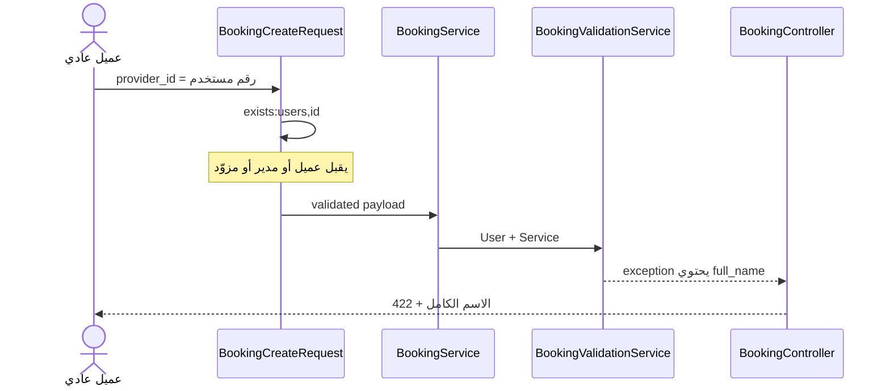
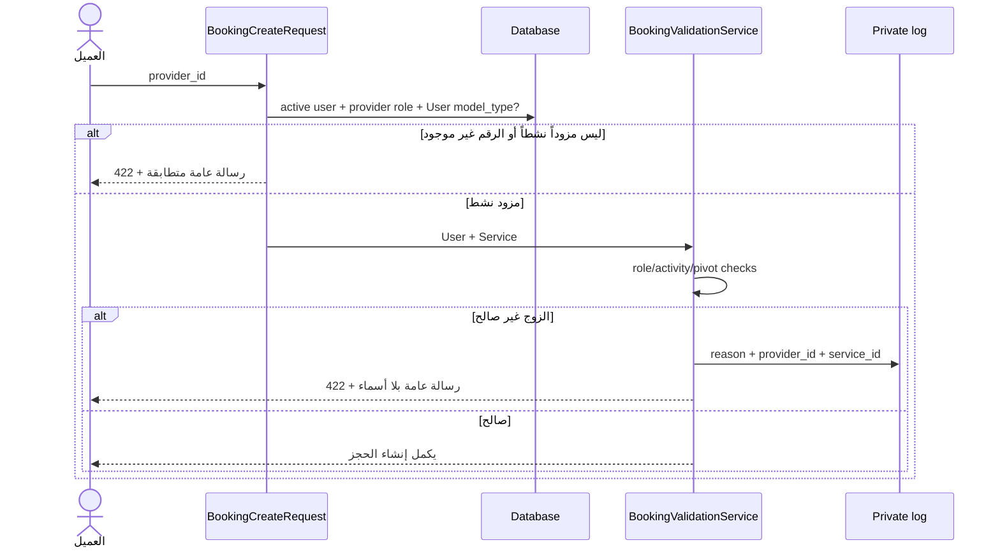

# AUTHZ-05 — منع تعداد المستخدمين عبر أخطاء إنشاء الحجز

> **التاريخ:** 29 أغسطس 2026  
> **الحالة:** ✅ مُصلحة ومغطاة باختبارات انحدار  
> **النطاق:** `POST /api/bookings` والتحقق الداخلي المشترك للحجز  
> **لا توجد تغييرات قاعدة بيانات أو تغييرات في عقد نجاح الحجز.**

---

## 1. الخلاصة التنفيذية

كانت قيمة `services.*.provider_id` تُفحص سابقاً بهذه القاعدة:

```php
'services.*.provider_id' => 'required|integer|exists:users,id',
```

هذه القاعدة تثبت أن الرقم موجود في `users` فقط، لكنها لا تثبت أن السجل:

- يحمل دور `provider`؛
- حسابه نشط؛
- أو يمكن استخدامه في الحجز المطلوب.

بعد مرور رقم أي عميل أو مدير موجود، كان `BookingService` يحمّل سجل `User` ثم تمرره إلى
`BookingValidationService::validateProviderOffersService()`. وعند عدم وجود علاقة
`provider_service` كان نص الاستثناء يضم الاسم الكامل:

```php
"Provider '{$provider->full_name}' does not offer service '{$service->name}'"
```

بعد ذلك أعاد `BookingController::store()` نص `InvalidArgumentException` نفسه إلى العميل
بحالة `422`. النتيجة: أرسل المهاجم رقماً وحصل على اسم لم يرسله ولم يكن مخولاً بقراءته.

الإصلاح الحالي يغلق القناتين معاً:

1. `BookingCreateRequest` لا يقبل إلا مستخدماً نشطاً يحمل دور `provider`.
2. `BookingValidationService` يعيد رسائل عامة بلا أسماء، ويعيد فرض شرط الدور والنشاط للمسارات التي قد تستدعي الخدمة من دون `FormRequest`.

المصدر: `app/Http/Requests/Api/BookingCreateRequest.php → activeProviderExistsRule`  
المصدر: `app/Services/BookingValidationService.php → validateProviderOffersService`

---

## 2. إثبات المشكلة قبل الإصلاح

أُضيف اختبار يقارن طلبين لهما الحمولة نفسها، والاختلاف الوحيد في `provider_id`:

- الطلب الأول يستخدم `id` لعميل حقيقي اسمه `Lina Hassan`؛
- الطلب الثاني يستخدم `id=999999` غير موجود.

النتيجة قبل الإصلاح كانت:

```diff
  {
    "success": false,
-   "message": "بيانات غير صحيحة",
-   "errors": {
-     "services.0.provider_id": ["مقدم الخدمة المحدد غير موجود"]
-   },
+   "message": "Provider 'Lina Hassan' does not offer service 'Hair Cut'",
    "error_type": "validation_error"
  }
```

هذا يثبت أمرين:

1. يستطيع العميل تمييز `id` الموجود من غير الموجود.
2. إذا كان `id` الموجود لا يخص مزوّداً، يحصل العميل على الاسم الكامل لذلك المستخدم.

لم يكن التسريب افتراضياً؛ اختبار الانحدار فشل فعلياً على الكود القديم بهذه الرسالة.

المصدر: `tests/Feature/Booking/Step4BookingCreationTest.php → does not reveal whether an arbitrary user id belongs to a real non-provider account`

---

## 3. مسار التسريب القديم



الخلل ليس أن `BookingController` يعيد أخطاء تحقق مفهومة بحد ذاته؛ الخلل أن طبقة الدومين
وضعت بيانات شخص داخل رسالة عامة تصل إلى مستخدم غير مخول بقراءتها.

---

## 4. تقييم الإصلاح المقترح في التقرير الأمني

اتجاه الإصلاح المقترح صحيح: تقييد `exists` بدور `provider` وإزالة الأسماء من الرسائل.
لكن تطبيقه حرفياً كان يحتاج تعديلين مهمين.

### 4.1 ضرورة تقييد `model_type`

جدول Spatie المسمى `model_has_roles` متعدد الأشكال. المفتاح `model_id` وحده غير كافٍ؛
قد يكون لنموذج آخر الرقم نفسه. لذلك أضيف الشرط:

```php
->where('booking_role_assignments.model_type', $userMorphClass)
```

ويُستخرج `$userMorphClass` عبر:

```php
(new User())->getMorphClass()
```

هذا يحترم أي `morph map` قد يضاف مستقبلاً بدلاً من افتراض أن القيمة المخزنة دائماً
هي النص `App\Models\User`.

### 4.2 عدم ربط التحقق بالـguard الحالي للطلب

أثناء اختبار الطلب الموثق، يغيّر Sanctum الـguard الافتراضي الجاري إلى `sanctum`، بينما
أدوار المشروع محفوظة تحت `guard_name=web`. إضافة شرط يعتمد على
`config('auth.defaults.guard')` داخل الطلب جعلت المزوّد الصحيح يُرفض في الاختبار.

لذلك التحقق يعتمد على:

- ارتباط الدور بنفس `User` عبر `model_type + model_id`؛
- واسم الدور `provider`؛

ولا يعتمد على guard متغير أثناء تنفيذ middleware المصادقة.

### 4.3 عدم الاعتماد على `FormRequest` وحده

`BookingValidationService::validateProviderOffersService()` مستخدمة أيضاً في تدفقات
الموظفين وإضافة الخدمات. لذلك تقييد API وحده كان سيغلق المدخل الحالي لكنه يترك invariant
الدومين قابلاً للكسر من مدخل آخر أو كود مستقبلي.

الإصلاح يعيد فحص `is_active` و`hasRole('provider')` داخل الخدمة نفسها.

---

## 5. التعديلات المنفذة

### 5.1 تقييد `provider_id` في `BookingCreateRequest`

أصبحت القاعدة:

```php
'services.*.provider_id' => [
    'required',
    'integer',
    $this->activeProviderExistsRule(),
],
```

وتبني `activeProviderExistsRule()` استعلام `exists` مقيّداً:

```php
return Rule::exists('users', 'id')->where(
    function (Builder $query) use (...) : void {
        $query
            ->where('users.is_active', true)
            ->whereExists(function (Builder $roles) use (...) : void {
                $roles
                    ->selectRaw('1')
                    ->from("{$modelHasRolesTable} as booking_role_assignments")
                    ->join(
                        "{$rolesTable} as booking_roles",
                        'booking_roles.id',
                        '=',
                        "booking_role_assignments.{$roleKey}",
                    )
                    ->whereColumn("booking_role_assignments.{$modelKey}", 'users.id')
                    ->where('booking_role_assignments.model_type', $userMorphClass)
                    ->where('booking_roles.name', 'provider');
            });
    },
);
```

### شرح كل جزء

| الجزء | الوظيفة |
|---|---|
| `Rule::exists('users', 'id')` | يبقي فحص وجود السجل داخل قاعدة البيانات ولا يحمّل قائمة المزوّدين إلى PHP. |
| `users.is_active = true` | يمنع استخدام مزوّد معطّل حتى لو بقي دور `provider` مرتبطاً به. |
| `whereExists(...)` | يطلب وجود إسناد دور مطابق للمستخدم نفسه. |
| `model_id = users.id` | يربط صف الدور بالمستخدم الذي يجري فحصه. |
| `model_type = $userMorphClass` | يمنع تطابق رقم يعود إلى Model آخر في pivot متعدد الأشكال. |
| `roles.name = provider` | يمنع العملاء والمديرين وأي دور آخر من المرور باعتبارهم مزودين. |
| أسماء الجداول والمفاتيح من `config('permission...')` | يبقي الكود متوافقاً إذا غُيّرت أسماء جداول Spatie أو مفاتيحها. |

رسالة فشل القاعدة أصبحت الرسالة العامة نفسها المستخدمة داخل الخدمة:

```php
'services.*.provider_id.exists' =>
    __('booking.provider_unavailable_for_service'),
```

وبذلك يحصل رقم عميل موجود ورقم غير موجود على الاستجابة العامة نفسها.

المصدر: `app/Http/Requests/Api/BookingCreateRequest.php → rules, activeProviderExistsRule, messages`

---

### 5.2 إعادة فرض invariant داخل `BookingValidationService`

قبل فحص pivot، تتحقق الخدمة الآن من كون المستخدم مزوّداً نشطاً ومن نشاط الخدمة:

```php
if (! $provider->is_active || ! $provider->hasRole('provider')) {
    $this->rejectProviderServicePair(
        $provider,
        $service,
        'user_is_not_an_active_provider',
    );
}

if (! $service->is_active) {
    $this->rejectProviderServicePair($provider, $service, 'service_is_inactive');
}
```

ثم يفحص علاقة `provider_service` النشطة. كل أسباب فشل أهلية الزوج تمر عبر دالة واحدة:

```php
private function rejectProviderServicePair(
    User $provider,
    Service $service,
    string $reason,
): never {
    Log::notice('Booking provider/service validation failed.', [
        'reason' => $reason,
        'provider_id' => $provider->id,
        'service_id' => $service->id,
    ]);

    throw new InvalidArgumentException(
        __('booking.provider_unavailable_for_service')
    );
}
```

### لماذا هذا الأسلوب؟

- العميل يرى سبباً قابلاً للفهم، لكن لا يرى اسم شخص أو اسم خدمة داخلياً.
- فريق التشغيل يرى في السجل الخاص `reason`, `provider_id`, و`service_id` اللازمة للتشخيص.
- لا نكرر PII في السجلات بلا حاجة؛ المعرّفات تكفي للوصول إلى السجلات داخلياً.
- استخدام `never` يوثّق أن الدالة لا تعود إلى المستدعي؛ نهايتها دائماً exception.
- جميع أسباب فشل الأهلية تستخدم الرسالة الخارجية نفسها، فلا تكشف هل الفشل بسبب الدور أو التعطيل أو pivot أو نشاط الخدمة.

المصدر: `app/Services/BookingValidationService.php → validateProviderOffersService, rejectProviderServicePair`

---

### 5.3 إزالة أسماء المزوّدين من بقية أخطاء الحجز

كشف المسح أن `full_name` ظهر أيضاً في ثلاثة فروع أخرى تصل إلى العميل عبر
`BookingController::store()`:

| الفرع | الرسالة القديمة | الرسالة الجديدة |
|---|---|---|
| المزوّد لا يعمل في اليوم | تضمنت `provider->full_name` واسم اليوم | `booking.provider_unavailable_on_date` |
| المزوّد في إجازة يوم كامل | تضمنت `provider->full_name` والتاريخ | `booking.provider_unavailable_on_date` |
| الموعد متعارض | تضمنت `provider->full_name` وبداية ونهاية الفترة | `booking.time_slot_unavailable` |

رسالة ساعات العمل خارج النطاق لا تتضمن اسماً، ولذلك احتُفظ بالمعلومات المفيدة عن الساعات.
رسالة الإجازة الجزئية كانت عامة أصلاً.

بعد التعديل لا توجد أي إشارة إلى `full_name`, `first_name`, أو `last_name` في
`BookingValidationService`.

المصدر: `app/Services/BookingValidationService.php → validateTimeSlotAvailability, validateProviderScheduleWindow`

---

### 5.4 الرسائل متعددة اللغات

أضيفت المفاتيح التالية إلى `lang/en/booking.php`, `lang/ar/booking.php`, و`lang/de/booking.php`:

```php
return [
    'provider_unavailable_for_service' => '...',
    'provider_unavailable_on_date' => '...',
    'time_slot_unavailable' => '...',
];
```

هذا يزيل النصوص الشخصية المضمّنة في PHP ويحافظ على استجابة مناسبة للغة API الحالية.

---

## 6. السلوك بعد الإصلاح

### رقم عميل حقيقي

```json
{
  "success": false,
  "message": "بيانات غير صحيحة",
  "errors": {
    "services.0.provider_id": [
      "The selected provider is unavailable for this service."
    ]
  },
  "error_type": "validation_error"
}
```

### رقم غير موجود

يعيد **JSON مطابقاً** للاستجابة السابقة. لا يظهر الاسم أو البريد ولا يستطيع العميل
تمييز الحساب الحقيقي غير المزوّد من الرقم غير الموجود عبر محتوى الاستجابة.

### مزوّد نشط لا يقدم الخدمة

```json
{
  "success": false,
  "message": "The selected provider is unavailable for this service.",
  "error_type": "validation_error"
}
```

لا يظهر اسم المزوّد ولا اسم الخدمة. اختلاف شكل استجابة مزوّد صالح عن رقم غير صالح لا
يكشف قائمة سرية للمزوّدين؛ دليل المزوّدين نفسه متاح عبر API عامة. الأهم في `AUTHZ-05`
هو أن أرقام العملاء والمديرين لم تعد تتحول إلى أسماء.

---

## 7. مسار التحقق الجديد



---

## 8. الاختبارات والتحقق

شُغّل ملف إنشاء الحجز المتأثر فقط، حسب نطاق المهمة:

```bash
php artisan test tests/Feature/Booking/Step4BookingCreationTest.php --stop-on-failure
```

النتيجة:

```text
43 passed
94 assertions
0 failed
```

الاختبارات الجديدة/المشددة تثبت:

1. استجابة رقم عميل حقيقي مطابقة لاستجابة رقم غير موجود.
2. عدم ظهور الاسم الكامل أو البريد في JSON.
3. عدم ظهور اسم المزوّد أو اسم الخدمة عند فشل الزوج.
4. فرض دور `provider` والنشاط داخل الخدمة حتى عند تجاوز `FormRequest`.
5. عدم ظهور الاسم في أخطاء عدم العمل والإجازة وتعارض الموعد.
6. استمرار إنشاء الحجز الصحيح وكل فروع `Step4` من دون تراجع.

لم تُشغّل مجموعة المشروع الكاملة بناءً على طلب المهمة.

---

## 9. تصحيح على التقرير الأمني الأصلي

وصف التقرير المسار بأنه «بلا سقف معدّل بسبب `AUTH-01 + CFG-01`». هذا لم يعد يطابق
الكود الحالي: `bootstrap/app.php` يستدعي `throttleApi()`، وبالتالي مجموعة API تحمل الحد
الافتراضي العام.

هذا لا يلغي `AUTHZ-05`: تحديد المعدّل يبطئ التسريب ولا يمنع خروج الاسم في كل استجابة
مسموحة. لذلك كان لا بد من إصلاح مصدر البيانات نفسه.

المصدر: `bootstrap/app.php → withMiddleware / throttleApi`

---

## 10. ملاحظات النشر والحدود المتبقية

- لا يوجد migration جديد.
- لا يوجد متغير `.env` جديد.
- لا يتغير payload نجاح الحجز.
- إذا كان الإنتاج يستخدم config/route cache، يُعاد بناء الكاش أثناء النشر بالطريقة المعتادة.
- مسار `/api/providers` عام، و`ProviderResource` يعرض بيانات المزوّدين وفق عقد API مختلف؛
  وهو سبب أن معرفة المزوّدين النشطين ليست السر الذي يحميه هذا البند. الملف يعرض حالياً
  `email` و`phone` أيضاً، ويستحق ذلك مراجعة خصوصية مستقلة قبل حذفه لأنه تغيير في عقد API.
- بقيت قضايا حجز موثقة في الاختبار نفسه، مثل open-ended full-day leave وإرجاع `500`
  للحجز غير الموجود؛ لم تُعدّل لأنها خارج نطاق `AUTHZ-05`.

---

## 11. قاعدة هندسية للمستقبل

لا يكفي أن يكون المعرّف موجوداً في الجدول؛ يجب التحقق من **أهليته الدومينية** للعملية.

```text
exists(users.id)                 = حقيقة تخزين
active + role(provider)          = أهلية هوية
active provider_service pivot    = أهلية للعملية
generic external error           = حدود إفصاح
structured private log           = قابلية تشخيص
```

أي معلومة يرسلها العميل ثم يستقبل مقابلها معلومة شخصية جديدة في الخطأ هي قناة إفصاح
يجب إغلاقها أو تخويلها صراحةً.
