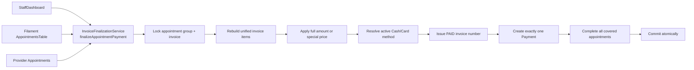

<div dir="rtl">

# MON-05 — توحيد تحصيل الدفع والفاتورة

> **الحالة:** ✅ مُصلَحة  
> **تاريخ التنفيذ:** 2026-09-10  
> **المسار المرجعي:** `StaffDashboard`  
> **نطاق الدفع الحالي:** داخل الصالون فقط — `cash` أو `card`  
> **TSE:** متوقف عمداً ولا يُجرى أي اتصال شبكي أثناء الدفع

---

## 1. الملخص التنفيذي

كان حدث تجاري واحد — «العميل دفع فاتورته» — منفذاً بعدة تطبيقات مختلفة:

1. `StaffDashboard` كان يستخدم `InvoiceFinalizationService`.
2. جدول المواعيد في Filament كان يبني عملية دفع كاملة داخله ويستخدم `InvoicePaymentService`.
3. صفحة مواعيد مقدم الخدمة كانت تستخدم `InvoiceService::createInvoiceFromAppointment()`.
4. بقيت نسخة عامة إضافية هي `InvoiceService::finalizeDraftInvoice()` رغم عدم استخدامها.

النتيجة لم تكن اختلافاً شكلياً. المسارات كانت تنتج حالات مالية مختلفة:

- بعضها ينشئ `Payment` وبعضها لا.
- بعضها يربط `payment_method_id` وبعضها يتركه `NULL`.
- بعضها ينهي كل المواعيد المرتبطة وبعضها ينهي السجل المضغوط فقط.
- بعضها يحفظ `cash` كقيمة آلية، وبعضها يحفظ نصاً بشرياً مثل `Paid On site Cash` أو `CASH`.
- أحد المسارات كان يحاول Fiskaly منفرداً، بينما البقية لا تفعل.

بعد الإصلاح أصبحت هناك عملية تطبيقية عامة واحدة:

```php
InvoiceFinalizationService::finalizeAppointmentPayment(
    Appointment $appointment,
    int|string $paymentMethod,
    ?float $finalAmount = null,
    ?string $notes = null,
    string $source = 'staff_dashboard',
    ?int $adjustedDuration = null,
): Invoice
```

كل واجهات الدفع تستدعيها، ولا توجد دالة أخرى في `InvoiceService` تستطيع إصدار فاتورة مدفوعة.

---

## 2. القرارات التجارية المعتمدة

### 2.1 مكان ووقت الدفع

- لا يوجد دفع عبر API أو بوابة إلكترونية حالياً.
- الدفع يتم داخل الصالون بعد تقديم الخدمة.
- لذلك نجاح الدفع يعني أن الخدمات المشمولة قُدّمت، وتتحول كل مواعيد الفاتورة إلى `COMPLETED`.

### 2.2 المبلغ الأقل ليس دفعة جزئية

إذا كان مجموع الخدمات `100.00 EUR` وأدخل الموظف `80.00 EUR`، فالمعنى هو:

```text
items_total       = 100.00
discount_amount   =  20.00  ← سعر خاص للزبون
invoice.total     =  80.00
payment.amount    =  80.00
payment.type      = full
invoice.status    = PAID
```

لا يبقى دين `20.00 EUR`. دعم الدفعات الجزئية ليس جزءاً من المنتج الحالي.

### 2.3 طرق الدفع

الطرق المسموحة أثناء التحصيل:

| الطريقة | `appointments.payment_method` | `PaymentStatus` |
|---|---|---|
| نقداً | `cash` | `PAID_ONSTIE_CASH` |
| بطاقة | `card` | `PAID_ONSTIE_CARD` |

صف `Payment` يحمل دائماً `payment_method_id` لصف فعال من `payment_methods`.

واجهة Staff تعرض Cash/Card فقط. عندما يحتوي جدول الطرق القديم على Credit وDebit معاً، فإن المفتاح العام `card` يفضّل Debit بصورة حتمية؛ أما واجهة Filament التي ترسل id محدداً فتحافظ على الاختيار المحدد.

### 2.4 الفاتورة الموحدة

- الفاتورة تعيش على الموعد الأب، أو على الموعد نفسه إن كان مستقلاً.
- خدمات الأب وكل الأبناء تُعاد قراءتها قبل الدفع.
- ينشأ صف `Payment` واحد للفاتورة كلها.
- كل المواعيد المشمولة تتحول إلى `COMPLETED` وتحمل حالة وطريقة الدفع نفسيهما.

### 2.5 TSE

TSE متوقف في هذه المرحلة. المسار الموحد:

- لا يستدعي `FiskalyService`.
- لا ينفذ أي اتصال شبكي.
- يحفظ metadata صريحة: `tse_enabled = false`.

هذا قرار تشغيلي مقصود، وليس نجاح توقيع وهمياً.

---

## 3. شكل الخلل قبل الإصلاح

| الخاصية | StaffDashboard | AppointmentsTable | Provider RelationManager |
|---|---:|---:|---:|
| ينشئ `Payment` | نعم | نعم | لا |
| يربط `payment_method_id` | لا | نعم | لا يوجد Payment |
| يعيد بناء فاتورة المجموعة | نعم | لا دائماً | لا |
| ينهي الأب والأبناء | نعم | السجل المحدد فقط | السجل المحدد فقط |
| قيمة `appointment.payment_method` | تسمية enum | اسم PaymentMethod | تسمية enum |
| TSE | placeholder | Fiskaly مشروط | لا |
| مكان قواعد العمل | Service | داخل UI + Service | InvoiceService |

كما وُجدت نسختان إضافيتان من منطق الإنهاء:

- `InvoiceService::createInvoiceFromAppointment()`.
- `InvoiceService::finalizeDraftInvoice()`.

ووجدت خدمة رابعة قادرة على كتابة الدفع:

- `Payments\InvoicePaymentService`.

---

## 4. البنية بعد الإصلاح



الواجهات أصبحت adapters رفيعة. لا تحسب حالة الفاتورة، ولا تنشئ Payment، ولا تولّد رقماً، ولا تقرر أي appointments يجب إنهاؤها.

---

## 5. التسلسل الذري للعملية

كل الخطوات التالية تقع داخل `DB::transaction()` واحدة:

1. تحديد `invoiceOwnerId = parent_appointment_id ?? id`.
2. قفل الموعد المالك بـ `lockForUpdate()`.
3. قفل كل `linkedGroup()` بترتيب `id`.
4. رفض المجموعة إذا احتوت موعداً ملغياً أو `NO_SHOW`.
5. حل `PaymentMethod` والتحقق أنه فعال وCash/Card.
6. قفل الفاتورة الموجودة.
7. إذا لم تعد `DRAFT`، رمي `InvoiceAlreadyFinalizedException`.
8. إنشاء/إعادة بناء المسودة من خدمات المجموعة كلها.
9. التحقق من المبلغ: موجب ولا يتجاوز مجموع الخدمات.
10. تطبيق السعر الخاص عبر `InvoiceService::applyFinalAmount()`.
11. حجز رقم الفاتورة داخل المعاملة نفسها.
12. تحديث الفاتورة إلى `PAID` مع metadata مدمجة.
13. تحديث كل المواعيد إلى `COMPLETED` وحالة دفع واحدة.
14. إنشاء `Payment` واحد برقم متسلسل و`payment_method_id` إلزامي تطبيقياً.
15. تثبيت المعاملة.

إذا فشلت أي خطوة، ترتد كل الخطوات. لا يمكن أن تبقى فاتورة مدفوعة بلا Payment بسبب فشل وقع في منتصف المسار.

---

## 6. مصدر الحقيقة لكل معلومة

| المعلومة | المصدر الرسمي |
|---|---|
| الخدمات والأسعار الأصلية | `invoice_items.total_amount` |
| السعر الخاص | `invoices.discount_amount` |
| المبلغ النهائي | `invoices.total_amount` |
| إثبات دخول المال | صف `payments` |
| طريقة التحصيل الفعلية | `payments.payment_method_id` |
| cash/card للاستهلاك القديم/API | `appointments.payment_method` بقيمة آلية ثابتة |
| وقت التحصيل | `payments.created_at` ثم metadata |
| الشاشة التي بدأت العملية | `invoice_data.finalization_method` و`payment_metadata.source` |
| قرار TSE الحالي | `tse_enabled = false` |

لا تُستخدم تسمية العرض كبيان آلي. `Paid On site Cash` و`CASH` و`Credit Card` نصوص عرض، أما القيم المستقرة فهي `cash` و`card` وFK الفعلي.

---

## 7. التعديلات ملفاً بملف

### 7.1 `app/Services/InvoiceFinalizationService.php`

أعيدت صياغتها لتملك العملية من أول `Appointment` حتى النتيجة النهائية.

أهم التغييرات:

- إضافة `finalizeAppointmentPayment()` كمدخل وحيد.
- حل الموعد الأب تلقائياً عند الاستدعاء من child.
- قفل المواعيد والفاتورة قبل فحص الحالة.
- إعادة بناء الفاتورة المجمعة داخل العملية.
- تطبيق السعر الخاص داخل العملية.
- قبول `cash`/`card` أو `PaymentMethod id` فعال.
- رفض PayPal/Stripe/Bank Transfer لأنها خارج النطاق الحالي.
- نسخ `subtotal` و`tax_amount` من الفاتورة إلى Payment بدلاً من حساب VAT مرة أخرى.
- كتابة `payment_method_id` الحقيقي.
- حفظ `payment_method` كـ `cash`/`card` على كل المواعيد.
- إنهاء كل المواعيد المغطاة.
- تسجيل source وcovered ids وقرار TSE في metadata والـ log.
- رفض صفر، السالب، الدفع الزائد، الموعد الملغي، والطريقة المعطلة.

### 7.2 `app/Livewire/StaffDashboard.php`

- بقيت الشاشة المرجعية للعملية.
- `paymentType` أصبح `cash` أو `card` بدلاً من أرقام enum في الواجهة.
- مبلغ المودال أصبح مجموع الأب والأبناء، لا مبلغ السجل المفتوح فقط.
- `processPayment()` لم يعد يبني أو يعدل أو ينهي الفاتورة بنفسه.
- يكتشف فقط هل غيّر الموظف السعر، ثم يستدعي الخدمة الموحدة.
- ما زال يتعامل مع الضغط المزدوج بإعادة الطباعة بدلاً من إنشاء دفعة أخرى.

### 7.3 `resources/views/livewire/staff-dashboard.blade.php`

- radio values أصبحت `cash` و`card`.
- لا تغيّر بصرياً طريقة استخدام الكاشير للشاشة.

### 7.4 `AppointmentsTable.php`

حُذفت الكتلة التي كانت:

- تحول DRAFT إلى PENDING يدوياً.
- تنشئ Payment عبر خدمة مستقلة.
- ترقم الفاتورة بنفسها.
- تحدث appointment واحداً.
- تستدعي Fiskaly منفردة.

الآن ترسل appointment و`payment_method_id` والمبلغ إلى `finalizeAppointmentPayment()` فقط. كما تعرض خيارات Cash/Credit/Debit الفعالة فقط، وكلها تتحول داخلياً إلى cash/card بصورة صحيحة. معاينة net/tax تستعمل `TaxCalculatorService` ومعدل `tax_rate` من الإعدادات بدلاً من معادلة float ثابتة على 19%.

### 7.5 `AppointmentsRelationManager.php`

- أزيل خيار online.
- خيارات الدفع أصبحت Cash/Card.
- المبلغ المقترح هو مجموع المجموعة.
- تعديل المدة الاختياري نُقل إلى المعاملة المركزية.
- معاينة net/tax تستخدم الحاسبة ومعدل الإعدادات نفسيهما.
- لم يعد يكتب إجماليات appointment ولا `COMPLETED` قبل نجاح الدفع.
- لم يعد يستدعي `createInvoiceFromAppointment()`.

### 7.6 `InvoiceService.php`

حُذفت منه عمليات إصدار الدفع المتنافسة:

- `createInvoiceFromAppointment()`.
- `createInvoice()` الخاصة بالمسار السابق.
- `updateAppointmentPaymentStatus()`.
- `finalizeDraftInvoice()` المكررة.

بقيت مسؤوليته في هذه الدورة:

- إنشاء المسودة.
- إنشاء البنود.
- إعادة بناء الفاتورة المجمعة.
- حساب السعر الخاص والخصم.

### 7.7 `Payments/InvoicePaymentService.php`

حُذفت بالكامل لأنها كانت كاتباً ثانياً لحالة الفاتورة وصفوف `payments`. منطقها الضروري أصبح جزءاً من العملية الموحدة.

### 7.8 الاختبارات

- أضيف `UnifiedPaymentFlowTest`.
- حُدث `DocumentNumberingTest` ليستعمل المدخل الجديد.
- حُدث `TaxParityTest` ليثبت أن Payment ينسخ التقسيم المالي نفسه.
- أضيف Cash/Card إلى `SalonFixture` كما في بيئة التطبيق.

---

## 8. أمثلة قبول

### مثال A — دفع نقدي كامل

```text
الخدمات:                  100.00
السعر النهائي:            100.00
الخصم:                      0.00
Invoice:                    PAID
Payment:                    100.00 / CASH / full
payment_method_id:          cash.id
appointments:               COMPLETED
TSE:                        disabled
```

### مثال B — زبون خاص

```text
الخدمات:                  100.00
السعر الذي حدده الموظف:     80.00
الخصم المسجل:               20.00
المتبقي كدين:                0.00
Payment:                     80.00 / CARD / full
Invoice:                     PAID
```

### مثال C — فاتورة أب + child

```text
الأب:                       100.00
الابن:                       50.00
Invoice items total:        150.00
عدد الفواتير:                    1
عدد Payments:                    1
حالة الأب:                  COMPLETED
حالة الابن:                 COMPLETED
```

### مثال D — فشل الإدخال

الحالات التالية تُرفض قبل إصدار أي سجل مالي نهائي:

- مبلغ `0` أو سالب.
- مبلغ أكبر من مجموع الخدمات.
- PaymentMethod معطل.
- Stripe/PayPal/Bank Transfer.
- فاتورة سبق إنهاؤها.
- مجموعة فيها موعد ملغي أو `NO_SHOW`.

وبعد الرفض تبقى الفاتورة `DRAFT` ولا ينشأ `Payment`.

---

## 9. الاختبارات المنفذة

الأمر:

```bash
php artisan test \
  tests/Feature/Money/UnifiedPaymentFlowTest.php \
  tests/Feature/Money/DocumentNumberingTest.php \
  tests/Feature/Money/TaxParityTest.php \
  tests/Feature/DailyReportTest.php
```

النتيجة:

```text
67 tests passed
440 assertions
```

التغطية المباشرة:

- Cash كامل.
- Card مع سعر خاص.
- `payment_method_id` غير مفقود.
- تطابق أرقام Invoice وPayment.
- تطابق net/tax/gross بين الجداول.
- أب + child + فاتورة واحدة + Payment واحد.
- الاستدعاء من child يصل إلى فاتورة الأب.
- منع الضغط المزدوج.
- رفض المبلغ صفر والدفع الزائد.
- رفض الطرق المعطلة والأونلاين.
- التأكد من غياب دوال الإنهاء البديلة في `InvoiceService`.
- بقاء تقرير الإيراد اليومي متسقاً مع تاريخ التحصيل وCash/Card والخصم.

---

## 10. البيانات الحالية والترحيل

المشروع ليس Production والبيانات الحالية تجريبية، لذلك لم يُنشأ backfill تخميني للسجلات القديمة. يمكن استخدام `migrate:fresh --seed` عندما تكون MySQL متاحة إذا كان المطلوب تنظيف بيئة التطوير بالكامل.

لم يُنفذ `migrate:fresh` أثناء هذا الإصلاح لأن خادم MySQL المحلي على `localhost:3306` لم يكن متاحاً، ولأن اختبارات `RefreshDatabase` أنشأت مخططاً نظيفاً وأثبتت السلوك الجديد دون الحاجة إلى حذف بيانات محلية.

---

## 11. قائمة QA يدوية

1. افتح موعداً مستقلاً في `/dashboard` وادفع Cash.
2. تأكد من طباعة رقم Invoice واحد ووجود Payment مرتبط بـ Cash.
3. أنشئ موعداً فيه عدة خدمات، ثم أضف child لمقدم آخر.
4. افتح الدفع من child وتأكد أن المبلغ المقترح يساوي المجموع كله.
5. غيّر السعر إلى سعر خاص وتأكد من ظهور الخصم على الإيصال.
6. تأكد أن الأب والchild أصبحا `COMPLETED`.
7. كرر من Filament Appointments واختر Card.
8. كرر من Provider Appointments.
9. افحص أن النتائج النهائية متطابقة، مع اختلاف `source` فقط.
10. اضغط زر الدفع مرتين بسرعة وتأكد من وجود Payment واحد.
11. تأكد من عدم وجود اتصال Fiskaly أو تحذير TSE.

---

## 12. قواعد لا يجوز كسرها مستقبلاً

1. لا تنشئ `Payment` من Controller أو Livewire أو Filament action.
2. لا تغيّر Invoice إلى `PAID` خارج `finalizeAppointmentPayment()`.
3. لا تولّد رقم Invoice/Payment خارج معاملة التحصيل.
4. لا تخزن تسمية بشرية داخل `appointments.payment_method`.
5. لا تسمح بصف Payment جديد بلا `payment_method_id`.
6. لا تدفع child بمعزل عن فاتورة الأب.
7. لا تفسر السعر الأقل كدفعة جزئية؛ هو سعر خاص/خصم كامل.
8. لا تضف online payment إلى هذه الدالة؛ يحتاج دورة حياة منفصلة.
9. لا توصل TSE من إحدى الواجهات منفردة؛ عند تفعيله مستقبلاً يجب أن يدخل من الخدمة المركزية وحدها.

</div>
